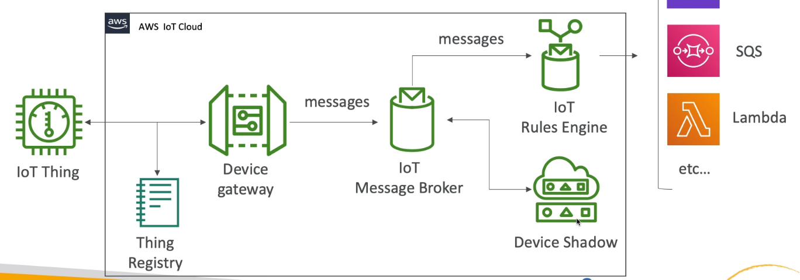

# **IoT.**

* Internet of things.
* IoT devices are named "things" in AWS.
* We can configure them & retrieve data from them.
* IoT things are registered using the IoT registry, where AWS will authenticate things like security of the device.

## **IoT Device Gateway.**

* Serves as an entrypoint for IoT devices connecting to AWS.
* Allows devices to securely & efficiently communicate with AWS IoT.
* Support MQTT, WebSockets & HTTP 1.1 protocols.
* Fully managed & scales automatically to support over a billion devices.
* No need to manage any infrastructure (serverless).

## **IoT Message Broker.**

* Pub/sub messaging pattern with low latency.
* devices can communicate with one another using this.
* Messages sent using MQTT, WebSockets or HTTP 1.1 protocols.
* Messages are published into topics (similar to SNS).
* Message broker forwards messages to all clients connected to the topic.
* Thus allows for multiple consumers.

## **IoT Thing Registry.**

* IAM of IoT.
* All connected IoT devices are represented in the AWS IoT registry.
* Organises resources associated with each device to the AWS cloud.
* Each device gets a unique ID.
* Supports metadata for each device.
* Can create X.509 certificates to help IoT devices connect to AWS.
* IoT Groups - can group devices together & apply permissions to the group.

## **Authentication.**

* 3 possible methods for IoT authentication:
    * Create X.509 certificates & load them securely onto the Things.
    * AWS SigV4.
    * Custom tokens with custom authorisers.
* For mobile apps:
    * Cognito identities.
* Web / Desktop / CLI:
    * IAM.
    * Federated identities.

## **Authentication.**

* AWS IoT policies:
    * Attached to X.509 certificates or Cognito Identities.
    * Able to revoke any device at any time.
    * IoT policies are JSON documents.
    * Can be attached to groups instead of individual things.
* IAM policies:
    * Attached to users, groups or roles.
    * Used for controlling IoT AWS APIs.