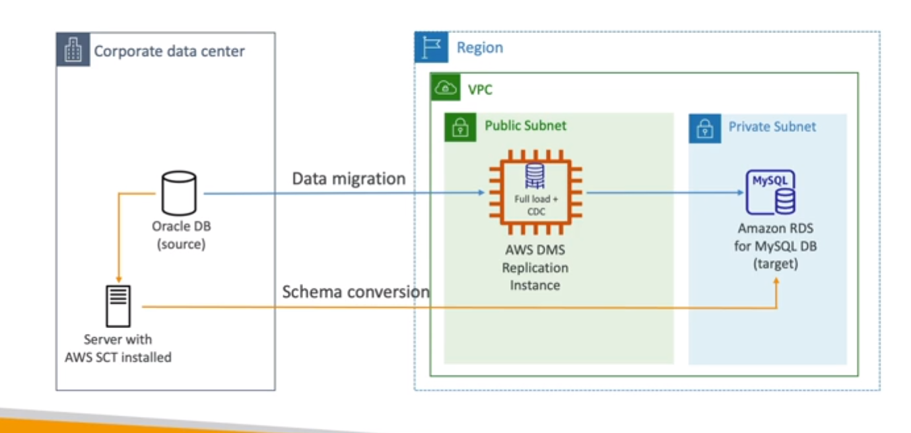

# **Database Migration Service.**

* Quickly & securely migrate databases to AWS.
* Resilient & self-healing.
* The source database remains available during migration.
* Supports:
    * Homogeneous migrations - i.e. Oracle to Oracle.
    * Heterogeneous migration - i.e. SQL Server to Aurora.
* Continuous data replication using CDC (Change Data Capture).
* You must create an EC2 instance to perform replication tasks.

## **Sources & Targets.**

* Sources:
    * On-premise & EC2 databases.
        * Oracle.
        * SQL Server.
        * MySQL.
        * MariaDB.
        * PostgreSQL.
        * MongoDB.
        * SAP.
    * Azure databases.
    * RDS databases, including Aurora.
    * S3.
    * DocumentDB.
* Targets:
    * On-premise & EC2 databases.
        * Oracle.
        * SQL Server.
        * MySQL.
        * MariaDB.
        * PostgreSQL.
        * SAP.
    * RDS.
    * Redshift.
    * DynamoDB.
    * S3.
    * OpenSearch Service.
    * Kinesis Data Streams.
    * Apache Kafka / MSK.
    * DocumentDB & Neptune.
    * Redis.

## **Schema Conversion Tool.**

* Convert your database schema from one engine to another.
* For example - in OLTP databases (SQL Server or Oracle), to MySQL, PostgreSQL & Aurora.
* You do not need to use SCT if you are migrating to the same DB engine.

## **Continuous Replication.**

