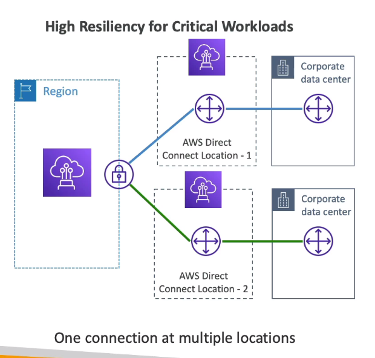

# **Direct Connect (DX).**

* Provides a dedicated private connection from a remote network to your VPC.
* Dedicated connection must be setup between your Direct Connect & AWS Direct Connect locations.
* You need to setup a Virtual Private Gateway on your VPC.
* Access public resources & private resources on the same connection.
* Use cases:
    * Increased bandwidth throughput - quicker when dealing with large datasets at a lower cost.
    * More consistent network experience for applications using real-time data feeds.
    * Hybrid clouds (on-prem + cloud).
* Supports both IPv4 & IPv6.

## **Direct Connect Gateway.**

* If you want to setup a Direct Connect into one or more VPC in many different regions (within the same account), you must use a Direct Connect Gateway.

## **Connection Types.**

* Dedicated connection - 1 Gbps, 10 Gbps & 100 Gbps capacity.
    * Physical ethernet port dedicated to the customer.
    * Request needs to be made to AWS & completed by AWS Direct Connect Partners.
* Hosted connection - 50 Mbps, 500 Mbps & 10 Gbps.
    * Connection requests are made via AWS Direct Connect Partners.
    * Capacity can be added or removed on demand.
* For both connection types, the lead times are often longer than 1 month to establish a new connection.

## **Encryption.**

* Data in transit is not encrypted but is completely private.
* AWS Direct Connect + A VPN connection provides an IPsec-encrypted private connection.
* Good for an extra layer of security, but more complex to implement.

## **Resiliency.**

* High resiliency for critical workloads:

* Maximum resiliency for critical workloads:

