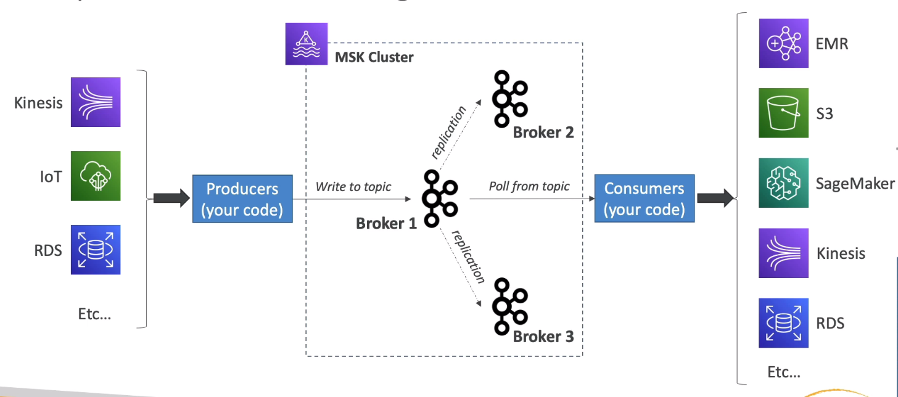
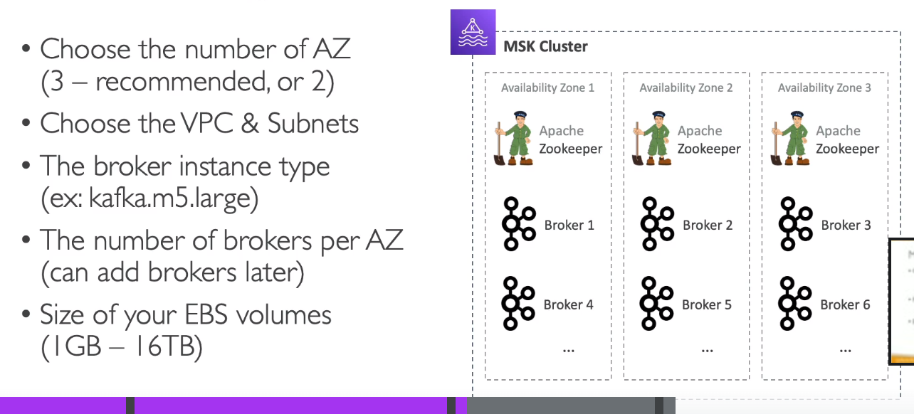
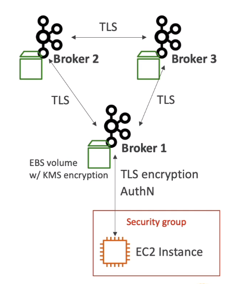

# **MSK - Managed Streaming for Apache Kafka.**

* Kafka is an alternative to Kinesis.
* A fully managed Apache Kafka service:
    * Allows you to create, update & delete clusters.
    * MSK creates & manages Kafka broker nodes & Zookeeper nodes for you.
    * You can deploy your MSK cluster in your VPC with multi-AZ enabled (up-to 3 AZ's for high availability).
    * Automatic recovery from common Kafka failures.
    * Data is stored on EBS volumes.
* You can build producers & consumers of data.
* You can create custom configurations for your clusters.
    * The default message size is 1 MB.
    * Possibility to configure large messages (up-to 10MB) into Kafka using a custom configuration.

## **Configurations.**

* Choose the number of AZ's (3 or 2 is recommended).
* Choose the VPC & subnets.
* The broker instance type (i.e. kafka.m5.large).
* The number of brokers per AZ (brokers can be added later if required).
* Size of your EBS volumes (1GB - 16TB).

## **Security.**

* Encryption:
    * TLS encryption in-flight between Kafka brokers.
    * Can be disabled if desired for slightly enhanced performance.
    * Optional in-flight TLS encryption between clients & brokers (can also be disabled).
    * At-rest encryption using KMS for EBS volumes.
* Network:
    * Authorise specific security groups for Kafka clients.
* Authentication & Authorisation:
    * Define who can read & write to which topics.
    * 3 different ways to achieve this:
        * Manual TLS certificates (AuthN) & Kafka ACLs (AuthZ).
        * SASL/SCRAM (username / password) (AuthN) & Kafka ACLs (AuthZ).
        * IAM Access Control (AuthN & AuthZ).
    * Kafka ACLs have to be defined from within your Kafka cluster.

## **Monitoring.**

* CloudWatch metrics:
    * Basic monitoring (cluster & broker metrics).
    * Enhanced monitoring (for enhanced broker metrics).
    * Topic-level monitoring (for enhanced topic-level metrics).
* Prometheus (Open-Source):
    * Opens a port on the broker to export cluster, broker & topic-level metrics.
    * Setup the JMX exporter (metrics) or Node exporter (CPU & disk metrics).
* Broker log delivery:
    * Deliver logs to CloudWatch.
    * Deliver logs to S3.
    * Deliver logs to Kinesis Data Streams.