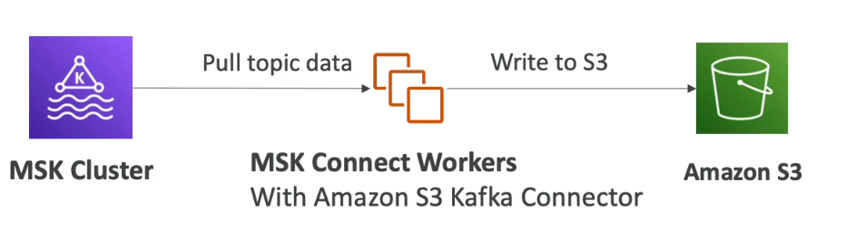

# **MSK Connect.**

* Managed Kafka Connect workers on AWS.
* Kafka Connect framework revolves around either:
    * Taking data from a source & placing it into Kafka.
    * Taking data from Kafka & placing it into a target.
* MSK Connect is AWS's hosted version of Kafka Connect.
* Auto-scaling capabilties for workers.
* You can deploy any Kafka Connect connectors to MSK Connect as a plugin.
* Some common plugins involve:
    * S3 Connector.
    * Redshift Connector.
    * OpenSearch Connector.

