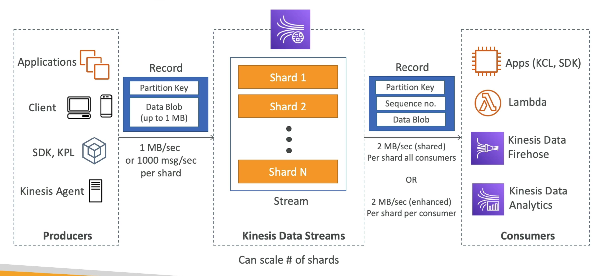
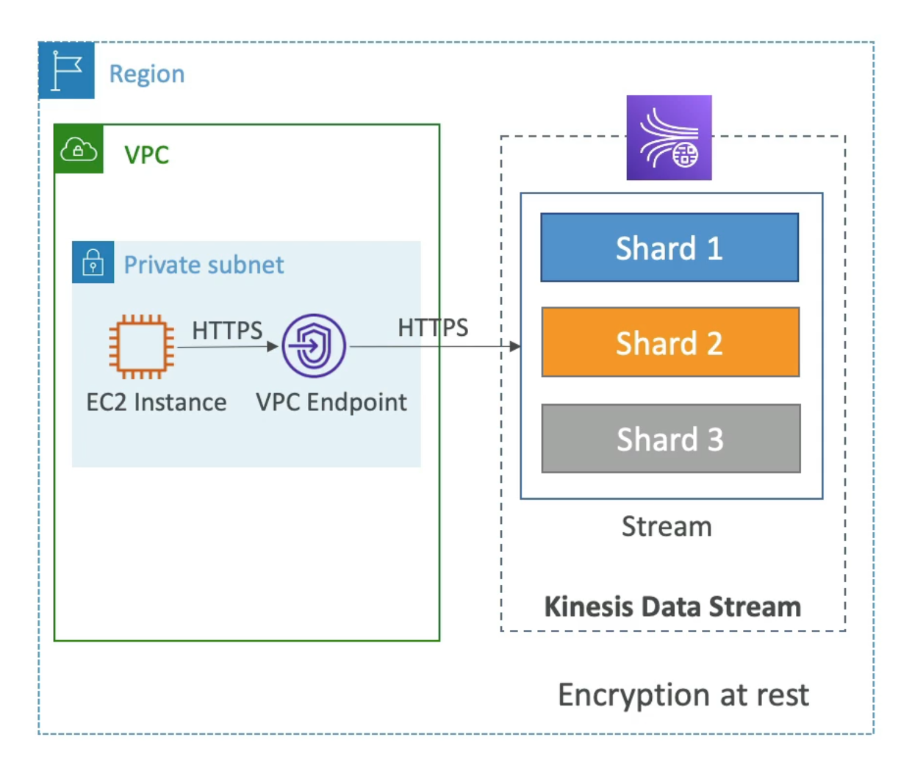

# **Kinesis Data Streams Overview.**

## **Properties of Kinesis Data Streams.**

* Retention is between 1 day & 365 days.
* Ability to reprocess/replay data.
* Data is immutable (cannot be deleted).
* Data that shares the same partition goes to the same shard (known as ordering).
* Producers:
    * AWS SDK.
    * Kinesis Producer Library (KPL).
    * Kinesis Agent.
* Consumers:
    * Can write your own application using the AWS CDK or Kinesis Client Library.
    * Lambda.
    * Kinesis Data Firehose.
    * Kinesis Data Analytics.

## **Capacity Modes.**

* **Provisioned Mode**:
    * You can choose the number of shards provisioned, scale manually or using the API.
    * Each shard gets 1MB/s in (or 1000 records per second).
    * Each shard gets 2 MB/s out (classic or enhanced fan-out consumer).
    * Pay per shard provisioned per hour.
* **On-Demand Mode**:
    * No need to provision or manage the capacity.
    * Default capacity provisioned is 4MB/s in (or 4000 records per second).
    * Scales automatically based on observed throughput peak during the last 30 days.
    * Pay per stream per hour & data in/out per GB.

## **Security.**

* Control access/authorisation using IAM policies.
* Encryption in flight using HTTPS endpoints.
* Encryption at rest using KMS.
* You can implement encryption/decryption of data on the client side.
* VPC Endpoints are available for Kinesis to access within a VPC.
* Can monitor API calls using CloudTrail.

