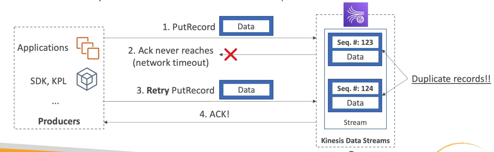

# **Kinesis - Handling Duplicates.**

## **Producers.**

* Producer retries can create duplicate records due to network timeouts.
* Kinesis producers never receive a 2xx/successful response from Kinesis after a PutRecord API call is made due to a network timeout.
* The data can still persist in Kinesis.
* The producer will then retry the same PutRecord API call into Kinesis, causing duplicate records.
* Both records will have unique sequence numbers as Kinesis will still acknowledge them as two different data points.
* **Fix - We can embed a unique record ID in the data to de-duplicate on the consumer side.**

## **Consumers.**

* Consumer retries can make your application read the same data twice.
* Consumer retries can happen when record processors restart.
* There are 4 main use cases relating to this:
    * A worker terminates unexpectedly.
    * Worked instances are added or removed.
    * Shards are merged or split.
    * When the application is deployed.
* Fixes:
    * Make your consumer applicaiton idempotent.
    * If the final recommendation can handle duplicates, we can duplicate handle there.