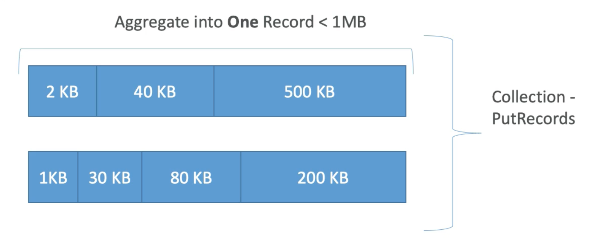
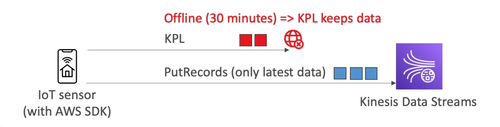

# **Kinesis Producers.**

## **SDK.**

* **PutRecord(s) API**:
    * PutRecords uses batching & increases throughput, this results in less HTTP requests.
    * ProvisionedThroughPutExceeded errors are thrown if you exceed throughput limits.
    * SDK can be used in appplications but also on mobile devices.
    * Use cases:
        * Lower throughput, higher latency applications.
        * A simple API.
        * Working directly from AWS Lambda.
    * Managed AWS sources for Kinesis Data Streams:
        * CloudWatch Logs.
        * AWS IoT.
        * Kinesis Data Analytics.

### **Dealing with Exceptions.**

* **ProvisionedThroughputExceeded**:
    * Happens when you are sending more data than permitted to specific shards (i.e. exceeding MB/s or Throughput/s for any shard).
    * Make sure that you  don't have a hot shard (such as you partition key isn't good enough & too much data is flowing to one specific shard).
* **Solution**:
    * Retries with backoff.
    * Increase the number of shards (scaling).
    * Ensure your partition key is a good, distributed key, ensuring that data flows to different shards as evenly as possible.

## **Kinesis Producer Library (KPL).**

* Easy to use & highly configurable C++/Java library.
* Used for building high performance, long-running producers.
* Automated & configurable retry mechanism.
* Synchronous & Asynchronous APIs can be used (asynchronous for better performance).
* Submits metrics to CloudWatch for monitoring.
* Supports batching (both turned on by default) - increases the throughput & decreases the cost.
    * Collect records & write to multiple shards in the same PutRecords API call.
    * Aggregate - increases the latency.
        * Capability to store multiple records in one singular instance (means we can go over the 1000 records per second limits).
        * Increases the payload size & improve throughput (maximize our 1 MB/s limit).
* Compression must be implemented by the user.
* KPL records must be de-coded with the KCL or "Special Helper Library".

### **KPL Batching.**

* We can influence the batching efficiency by introducing some delay with the RecordMaxBufferedTime parameter (which defaults to 100ms).
*  This parameter tells Kinesis how long to wait for additional data before we hit our batching quotas.

### **When not to use the KPL.**

* The KPL can incur an additional delay up to the value set by the user of the parameter RecordMaxBufferedTime (this is user configurable).
* Larger values of RecordMaxBuffer Time results in higher packing efficiencies & better performance.
* **Applications that cannot tolerate this additional delay may need to use the AWS SDK directly**.
* A good example of this is an IoT sensor going offline but still accumulating data to be sent to Kinesis when it comes back online.

## **Kinesis Agent.**

* Monitors log files & sends them directly to Kinesis streams.
* Java-based agent, built on top of the KPL.
* Install only on Linux based servers.
* Features include:
    * Writes from multiple directories & write to multiple streams.
    * Routing feature based on directory / log file.
    * Pre-process data before sending to streams (csv to json etc.).
    * Agent handles file rotation, checkpointing & retry upon failures.
    * Emits metrics to CloudWatch for monitoring.