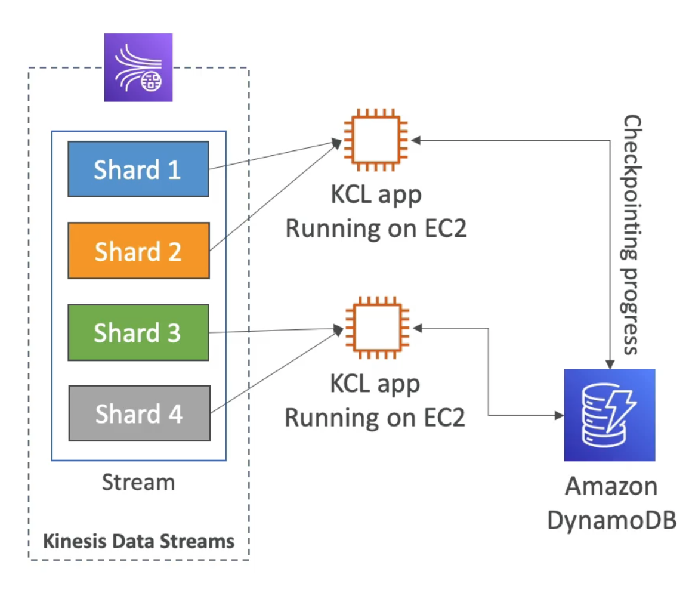

# **Kinesis Consumers.**

* Kinesis SDK.
* Kinesis Client Library (KCL).
* Kinesis Connector Library.
* 3rd party libraries such as Spark, Log4J, Flume, Kafka, etc.
* Kinesis Firehose.
* AWS Lambda.

## **Kinesis SDK - GetRecords.**

* Records are polled by consumers from a specific shard.
* Each shard has 2MB total aggregate throughput.
* GetRecords returns up to 10MB of data (then throttle for 5 seconds due to 2MB limit), or up to 10,000 records.
* Maximum of 5 GetRecords API calls per shard per second - this means that we get 200ms of latency for our data.
* If 5 consumer applications consume from the same shard, then each consumer can only make 1 GetRecords API call per second - resulting in a potential second's worth of latency for our data processing.
* This architecture will also affect our throughput due to the 2MB limit - each consumer will now receive less than 400KB/s.

## **Kinesis Client Library (KCL).**

* A Java-first library but exists for other languages too (i.e. Python, Go, etc...).
* Read records from Kinesis produced with the Kinesis Producer Library.
* Share multiple shards with multiple consumers in one "group".
* Has a feature known as **shard discovery**.
* Has a **checkpointing** feature to resume progress.
* Leverages DynamoDB for coordination & checkpointing (one row per shard).
    * Make sure you provision enough write capacity units & read capacity units.
    * Or use on-demand mode for DynamoDB.
    * Otherwise DynamoDB may slow the KCL down.
* Record processors will process the data.
* **ExpiredIteratorException = increase the WCU for your DynamoDB table.**

## **Kinesis Connector Library.**

* Older Java library which leverages the KCL library.
* Runs on EC2 instances.
* Can write data to S3, DynamoDB, Redshift, ElasticSearch.
* A lot of this functionality is now covered by Kinesis Firehose & Lambda.

## **Lambda sourcing from Kinesis.**

* Lambda can source records from Kinesis.
* Lambda consumer has a library to de-aggregate records from the KPL.
* Lambda can be used to run lightweight ETL to:
    * DynamoDB.
    * S3.
    * Redshift.
    * ElasticSearch.
    * Anywhere you want.
* Lambda can be used to trigger notifications / send emails in real time.
* Lambda has a configurable batch size.