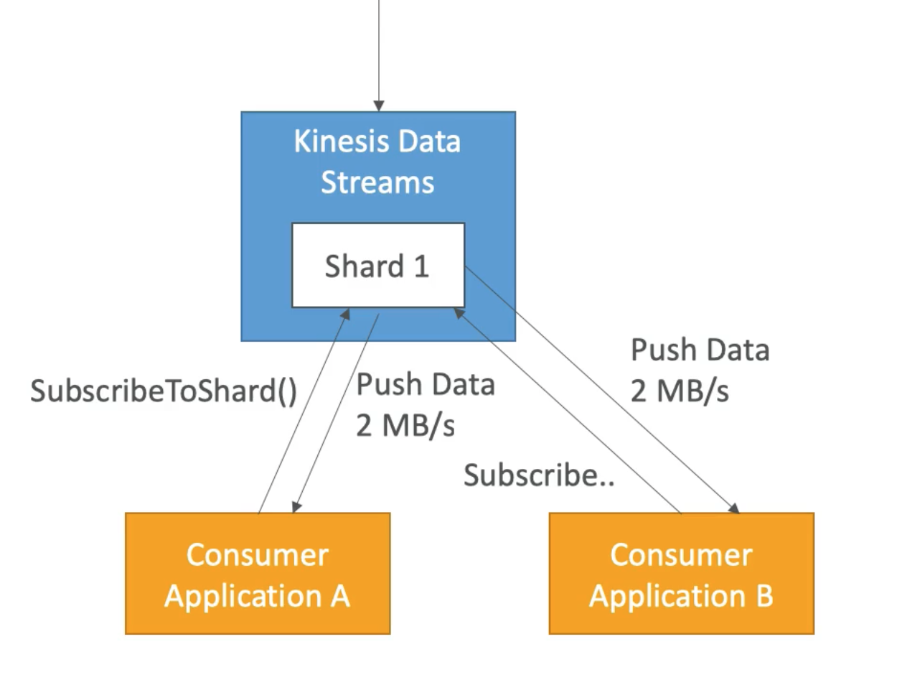

# **Kinesis Enhanced Fan Out.**

* Works with KCL 2.0 & AWS Lambda.
* Each consumer gets 2MB/s of provisioned throughput per shard.
* That means that if we have 20 consumers of a single shard, each consumer will get 2MB/s of provisioned throughput for a total aggregated throughput of 40MB/s per shard.
* No more 2MB/s limit per shard!
* The reason this limitation no longer exists is because **kinesis now pushes data to consumers via HTTP/2, as opposed to consumers polling kinesis shards**.
* This results in increased benefits:
    * Better scalability.
    * Reduced latency (~70 ms).

## **Enhanced Fan-Out vs Standard Consumers.**

* Standard consumers:
    * Low number of consuming applications (1, 2, 3, ...).
    * Can tolerate ~200 ms latency.
    * Minimise costs.
* Enhanced Fan-Out:
    * Multiple consumer applications from the same stream.
    * Low latency requirements.
    * Higher costs.
    * Default limit of 20 consumers using enhanced fan-out per data stream.