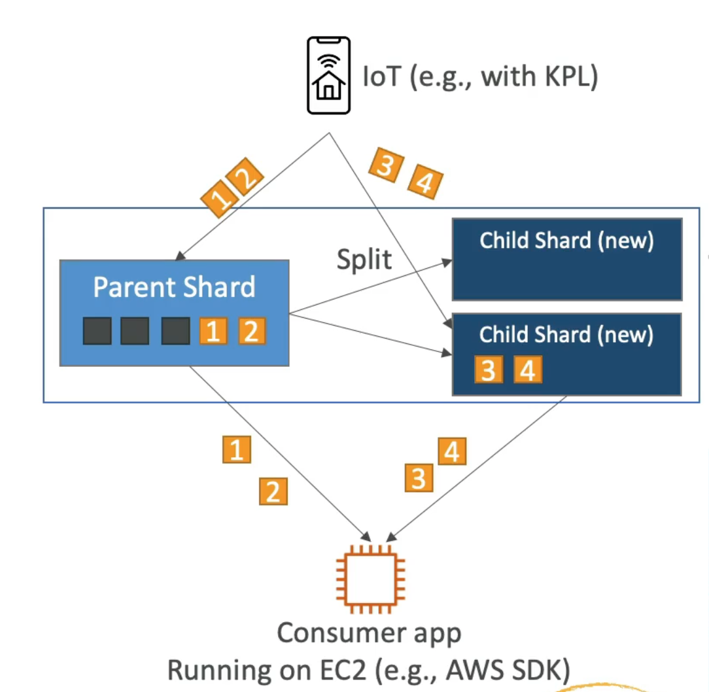

# **Kinesis Scaling.**

## **Adding Shards.**

* This is also called "shard splitting".
* Can be used to increase the stream capacity (1 MB/s data in per shard).
* Can be used to divide a "hot shard".
* When you split a shard, the old shard is closed & will be deleted when the data within the shard has expired.

## **Merging Shards.**

* Decrease the stream capacity & save costs.
* Can be used to group two shards with low traffic.
* Old shards are closed & deleted based on data expiration.

## **Out-of-order records after resharding.**

* After a reshard, you can read from the child shards.
* However, if data could still persist in the parent shard.
* If you start reading from the child shard before you finish reading all data from the parent shard, **you could read data for a particular hash key out of order**.
* After a reshard, read entirely from the parent until you don't have any new records.
* Note - the Kinesis Client Library has this logic built-in to cope with re-sharding operations.

## **Auto Scaling.**

* Auto scaling is not a native feature of Kinesis.
* The API call to change the number of shards is UpdateShardCount.
* We can implement auto scaling with Lambda (but is slightly out of scope).

## **Scaling Limitations.**

* Resharding cannot be done in parallel.
* You can only perform one resharding operation at a time & usually takes a few seconds.
* For 1000 shards, it takes 30k seconds to double the shards to 2000.
* You cannot do the following:
    * Scale more than 10x for each rolling 24-hour period for each stream.
    * Scale up to more than double your current shard count for a stream.
    * Scale down below half your current shard count for a stream.
    * Scale up to more than 500 shards in a stream.
    * Scale a stream with more than 500 shards down unless the result is fewer than 500 shards.
    * Scale up to more than the shard limit for your account.