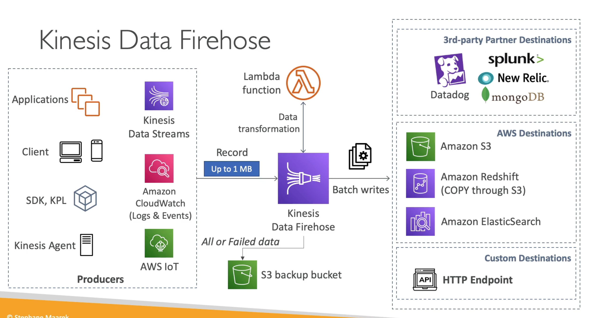

# **Kinesis Data Firehose.**

* Used for storing streaming data in a multitude of target destinations.
* Is a near real-time service, as Firehose attempts to batch records for write operations in the target destination (60 seconds latency minimum for non full batches).
* Fully managed service with no administration.
* Most common destinations are:
    * Redshift.
    * S3.
    * ElasticSearch.
    * Splunk.
* Has auto scaling capabilities.
* Can handle JSON conversions to parquet format (for S3 storage only).
* Can also transform data via. Lambda (i.e. JSON -> CSV).
* Support compression when the target destination is S3.
* Only GZIP compression format is supported for a Redshift load.
* You pay for the amount of data going through Firehose.
* **Spark & Kinesis Client Library cannot read from Kinesis Data Firehose**.
* Can archive transformation or delivery failures into an S3 bucket (you do not lose data with Firehose).

## **Firehose Buffer Sizing.**

* Firehose accumulates records in a buffer.
* The buffer is flushed based on time & size rules.
    * Flushed based on buffer size - if a buffer size is reached, the buffer is flushed.
    * Flushed based on time - if a specific amount of time is reached, the buffer is flushed.
* Firehose can automatically increase the buffer size to increase the throughput.
* High throughput = buffer size will be hit.
* Low throughput = buffer time will be hit.

## **Streams vs Firehose.**

* Streams:
    * Custom code needs to be written for producers & consumers.
    * Real-time data streaming with 200ms of latency for classic architecture & 70ms of latency with enhanced fan-out architecture.
    * Must manage scaling such as shard splitting & merging.
    * Can configure data storage for between 1-365 days.
    * Data replay ability.
    * Multiple consumers.
    * Can be used in conjunction with Lambda to insert data to destination applications in real-time.
* Firehose:
    * Fully managed, used to send data to S3, Splunk, Redshift & ElasticSearch.
    * Serverless data transformations with AWS Lambda.
    * Near real-time.
    * Lowest buffer time is 60 seconds.
    * Auto-scaling capabilities.
    * No data storage or replayability.
