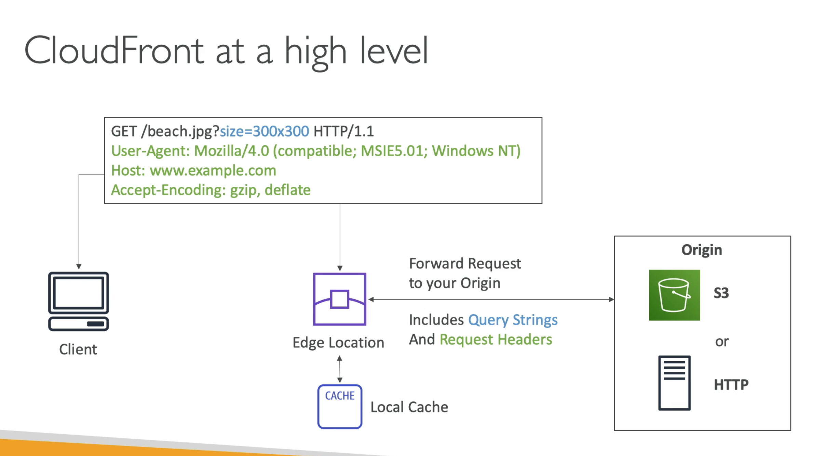
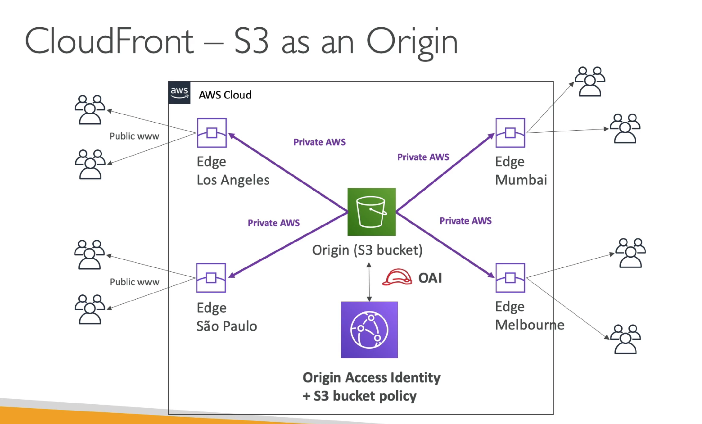
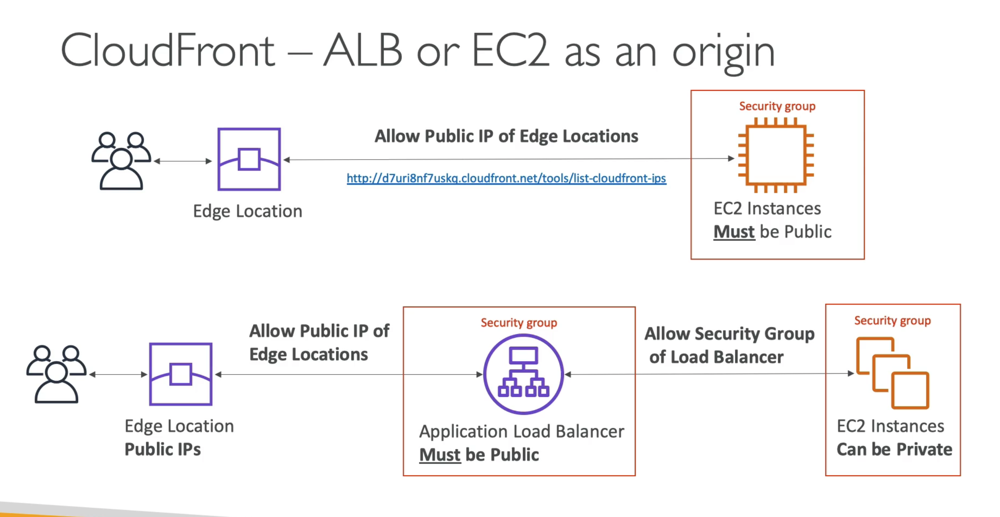

# **AWS CloudFront Overview.**

Cloudfront is a **Content Delivery Network.**

* This improves read performance, where content is cached at edge location.
* 216 Points of Presence currently globally (known as edge locations).
* DDoS protection, integration with AWS Shield, AWS Web Application Firewall (WAF).
* Can expose external HTTPS & can talk to internal HTTPS backends.

## **CloudFront Origins.**

* S3 bucket:
    * For distributing files and caching them at the edge.
    * Enhanced security with CloudFront **Origin Access Identity (IAO)**.
    * CloudFront can be used as an ingress (meaning that it can be used to upload files to S3).
* Custom Origin (HTTP Origin):
    * i.e. from an Application Load Balancer.
    * An EC2 Instance.
    * An S3 website (after enabling the bucket as a static S3 site).
    * Any HTTP backend you want.

## **CloudFront H-L.**

Below is a H-L diagram of how CloudFront works under the hood.

## **Origin - S3.**

Below is a H-L diagram of how CloudFront works when S3 is the origin.

## **Origin - ALB or EC2.**

Below is a H-L diagram of how CloudFront works when an ALB/EC2 is the origin.

## **CloudFront Geo Restriction.**

* You can restrict who can access your distribution:
    * **Whitelist** - Allow your users to access your content only if they're in one of the countries on a user-defined list of approved countries.
    * **Blacklist** - Prevent users from accessing your content if they're in one of the user-defined countries of banned countries.
* The "country" is determined using a 3rd party Geo-IP database.
* Use Case: Copyright Laws that mean you have to control access to your content.

## **CloudFront vs S3 Replication.**

* CloudFront:
    * A Global Edge Network.
    * Files are cached for a TTL (might be a day).
    * **Great for static content that must be available everywhere.**
* S3 Cross-Region Replication:
    * Must be setup for each region you want to replicate to.
    * Files are updated in near real-time.
    * Read only.
    * **Great for dynamic content that needs to be available at low-latency in a few regions.**