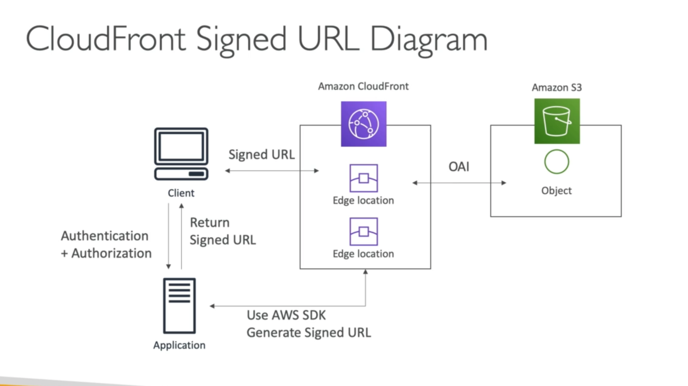

## **CloudFront Signed URLs & Cookies.**

* You want to distribute paid shared content to premium users all over the world.
* We can use a CloudFront Signed URL / Cookie.
* We can attach a policy that:
    * Includes URL expiration.
    * Includes IP ranges to access the AWS data from.
    * Trusted signers (which AWS accounts can create signed URLs).
* How long should the URL be valid for?
    * Shared content such as movies or music.
    * Private content (to the user) - can make it last for years.
* **Signed URLs give access to individual files (one to one).**
* **Signed Cookies give access to multiple files (one to many).**

## **CloudFront Signed URL.**

Below is a H-L diagram that illustrates how Signed URLs work with CloudFront.

## **CloudFront Signed URL vs S3 Pre-Signed URL.**

* CloudFront Signed URL:
    * Allows access to a path, no matter the origin.
    * Account wide key-pair, only the root can manage it.
    * Can filter by IP, path, date, expiration.
    * Can leverage caching features.
* S3 Pre-Signed URL:
    * Issue a request as a person who pre-signed the URL.
    * Uses the IAM key of the signing IAM principle.
    * Limited lifetime.