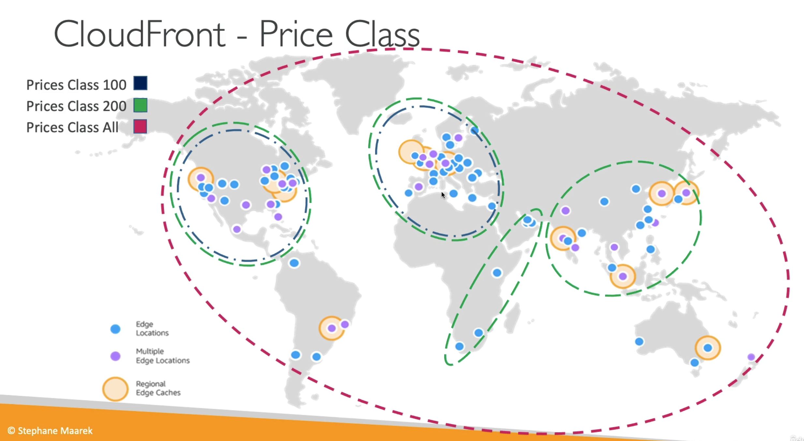
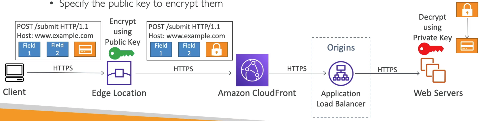

# **CloudFront Advanced Concepts.**

## **Pricing.**

* CloudFront edge locations are located all around the world.
* This means that the cost per data out of each edge location varies depending on where it lies in the world.
* The more data that is transferred out of CloudFront, the lower the cost.
* You can reduce the number of edge locations for some **cost reduction**.
* There are 3 price classes available:
    * All - utilises all regions, gives the best performance.
    * 200 - utilises most regions, but excludes the most expensive regions.
    * 100 - only utilises the least expensive regions.

## **Multiple Origin.**

You may want to re-route the client to different origins based on the content type. Based on the path pattern we can route clients to "/images/*", "/api/\*" or "/\*"...

## **Origin Groups.**

* To increase high-availability and ensure failover.
* Origin Group's consist of one primary and one secondary origin.
* If the primary origin fails, the second one is used.

## **Field Level Encryption.**

* Protects user sensitive information through the application stack.
* Adds an additional layer of security along with HTTPS.
* Sensitive information is encrypted at the edge closer to the user.
* Uses asymmetric encryption.
* Works by:
    * Setting a specific set of fields in POST requests that you want to be encrypted (up to 10).
    * Specify the public key to encrypt them.

