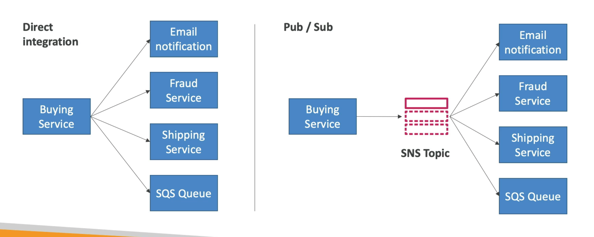

# **AWS SNS.**

* SNS stands for Simple Notification Service.
* What if you want to send one message and have many receivers?
* We can have a pub / sub model (publisher / subscriber).
* This allows multiple subscribers to receive the same message (including SQS queues!).

## **How does it work?**

* The "event producer" only sends a message to the SNS topic.
* As many "event receivers" (or subscribers) as we want can listen to the SNS topic for notifications.
* Each subscriber to the topic will get all the messages (unless we use a new feature that allows for the topic to "filter" notifications).
* Can have up to 12,500,000 subscriptions per topic.
* 100,000 topics limit.
* Subscribers can be:
    * SMS & Mobile notifications.
    * HTTPS endpoints.
    * To send emails.
    * SQS.
    * Lambda.
    * Kinesis Data Firehose.

## **SNS Integration with AWS Services.**

* Many AWS services can also send notifications directly to an SNS topic.
* These include:
    * CloudWatch.
    * Lambda.
    * EventBridge.
    * DynamoDB.
    * S3.
    * Auto Scaling Group Notifications.
    * ...

## **How to Publish.**

* Topic Publish (using the SDK):
    * Create a topic.
    * Create a subscription (or many).
    * Publish the topic.
* Direct Publish (for mobile apps SDK):
    * Create a platform application.
    * Create a platform endpoint.
    * Publish to the platform endpoint.
    * Works with Google GCM, Apple APNS, Amazon ADM...

## **Security.**

* Encryption:
    * In-flight encryption using HTTPS API.
    * At-rest encryption using KMS keys.
    * Client-side encryption if the client wants to perform encryption/decryption themselves.
* Access Controls:
    * IAM policies to regulate access to the SNS API.
* SNS Access Policies (similar to S3 bucket policies):
    * Useful for cross-account access to SNS topics.
    * Useful for allowing other services (such as S3) to write to an SNS topic.