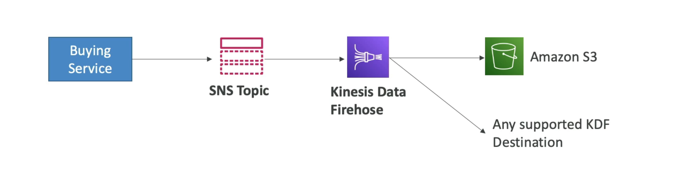
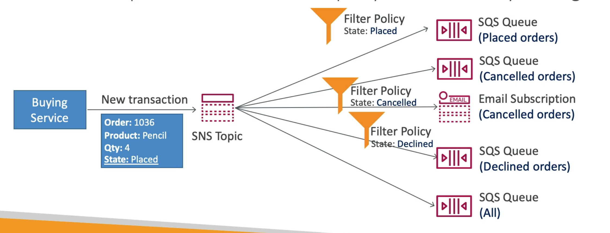

# **SNS & SQS Fan Out Approach.**

What if we want to a single event to multiple SQS queues?

* The idea here is that we only need to push the message once to SNS, the SNS subscribers (in this case multiple SQS queues) will all receive the same message.
* This is where the concept of "fan out" comes from.
* Fully decoupled model, no data loss.
* SQS allows for:
    * Data persistence.
    * Delayed processing.
    * Retries of work.
* We also have the ability to add more subscribers much more easily when required.
* Make sure your SQS queue access policy allows for SNS to write to it.

## **S3 Events into Multiple Queues.**

* For the same combination of event type (e.g. object create) and prefix (e.g. images/), you can only have one S3 event rule.
* If you want to send the same S3 event to many SQS queues, use fan-out.

## **SNS to S3 through Kinesis Data Firehose.**

* SNS can send data to Kinesis and therefore we can have the following solutions architecture:

## **SNS - FIFO Topic.**

* SNS also has FIFO capability similar to SQS.
* we get the following:
    * Ordering by Message Group ID.
    * Deduplication using a Deduplication ID or Content Based Deduplication.
* Can only have SQS FIFO queues as subscribers.
* Same limited throughput as SQS.
* You can also have SNS FIFO & SQS FIFO Fan Out architecture as above.

## **Message Filtering.**

* JSON policy can be used to filter messages sent to the SNS topic's subscriptions.
* If a subscription doesn't have a filter policy, it receives every message.
* Our order architecture may look something like the below, using different message filtering:

