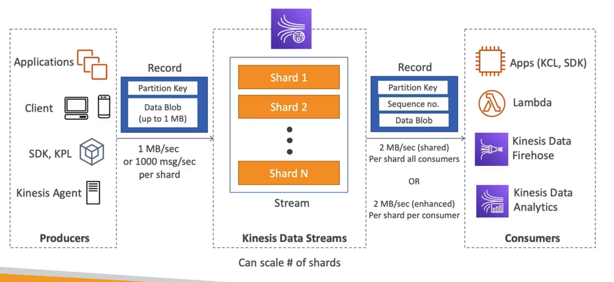

# **Kinesis Overview.**

* Makes it easy to collect, process & analyse streaming data in real-time.
* This allows us to ingest real-time data such as:
    * Application logs.
    * Metrics.
    * Website clickstreams.
    * IoT telemetry data.
* There are 4 components to Kinesis:
    * Kinesis Data Streams - used to capture, process & store data streams.
    * Kinesis Data Firehose - used to load data streams into AWS data stores (such as S3).
    * Kinesis Data Anayltics - used to analyse data streams with SQL or Apache Flink.
    * Kinesis Video Stream - used to capture, process & store video streams.

## **Kinesis Data Streams.**

* Kinesis Data Streams consist of Streams made of something called "Shards".
* Shards are numbered, and can be scaled.
* More Shards = better throughput in the stream.
* There are still producers just as with SQS, most commonly, these can be one of:
    * Application using Kinesis Producer Library.
    * Kinesis Agents.
* Producers send records to the stream, each record is made of a:
    * Partition Key.
    * Data Blob (up to 1 MB).
* Each shard gives 1MB/sec or 1000 messages/sec.
* Similar to with SQS, we also have Consumers, common Consumers are things like:
    * Applications that will use Kinesis Client Library & the AWS SDK.
    * Lambda Functions.
    * Kinesis Data Firehose.
    * Kinesis Data Analytics.
* Consumers receive records with the following attributes:
    * Partition Key.
    * Sequence Number.
    * Data Blob.
* There are two different types of Consumer throughput you can configure depending on your use case:
    * Shared - Each shared gives 2 MB/sec to all consumers.
    * Enhanced - Each shared gives 2 MB/sec to all consumers.

## **Data Stream Properties.**

* Retention can be set between 1-365 days.
* There is the ability to reprocess or replay data.
* Once data is inserted into Kinesis, it cannot be deleted - this is called immutability.
* Data that shares the same partition goes to the same shard (ordering).

## **Capacity Modes.**

* Provisioned mode:
    * You choose the number of shards provisioned, can scale these manually or use the API.
    * Each shard gets 1 MB/s in (or 1000 records per second).
    * Each shard gets 2 MB/s out (classic or enhanced fan-out consumer).
    * You pay per shard provisioned per hour.
* On-demand mode:
    * No need to provision or manage any capacity.
    * Default capacity provisioned (4 MB/s in or 4000 records per second).
    * Scales automatically based on observed throughput peak during the last 30 days.
    * Pay per stream per hour & data in/out per GB.

## **Kinesis Data Firehose.**

* Firehose is used to store data in target destinations.
* A common use case here is into S3.
* Firehose can read directly from Producers, these include:
    * Applications.
    * Kinesis Data Streams.
    * Cloudwatch Logs.
    * IoT.
* Reads each record received from the Producer.
* Can enhance / build-out back-end capabilities by getting further applications such as Lambda functions to validate / enrich / transform the data.
* Firehose then writes in batch to the target destination, this can be something like:
    * S3*.
    * ElasticSearch*.
    * RDS (Redshift)*.
    * 3rd party applications such as DataDog, MongoDB...
    * Custom destinations with valid HTTP endpoints.
* You can also send failed data to a backup S3 bucket.

## **Firehose Properties.**

* Fully managed service, no administration.
* Automatically scales (serverless).
* You pay for data going through Firehose.
* It's a near real-time service:
    * There's a 60 second latency (minimum) for non full batches.
    * Or minimum of 32 MB of data at a time.
* Supports many different data formats, conversions, transformations & compressions.

## **Data Streams vs Firehose.**

Data Streams:
* Streaming service for ingest at scale.
* Write custom code.
* Real-time service.
* Manage scaling using shard-splitting (scaling down) & shard-merging (scaling up).
* Data storage between 1-365 days.
* Supports replay capability.

Firehose:
* Loads streaming data into AWS / 3rd Party / Custom services.
* Fully managed.
* Near real-time.
* Automatic scaling.
* No data storage.
* Doesn't support replay capability.

## **Data Analytics (for SQL applications).**

* You can write custom SQL analytics ontop of your Kinesis Data Stream or Kinesis Firehose applications.
* Data Analytics can send results to "sinks" for further analysis.
* Add reference data from S3 to enrich streaming data.
* It is a fully managed service.
* Automatic scaling.
* Real-time analytics.
* Pay for the actual consumption rate.
* Can create streams out of the real-time queries.
* Use cases include:
    * Time-series analytics.
    * Real-time dashboards.
    * Real-time metrics.

## **Data Analytics (for Apache Flink applications).**

* Use Flink (Java, Scala or SQL) to process & analyse streaming data.
* 2 data sources:
    * Kinesis Dara Streams.
    * Amazon Managed Kafka (MSK).
* Run any Apache Flink application on a managed cluster on AWS.
    * Provisioning of compute resources, parallel computation, automatic scaling.
    * Application backups (implemented as checkpoints & snapshots).
    * Use any Apache Flink programming features.
    * Flink does not read from Firehose (use Kinesis Analytics for SQL instead).