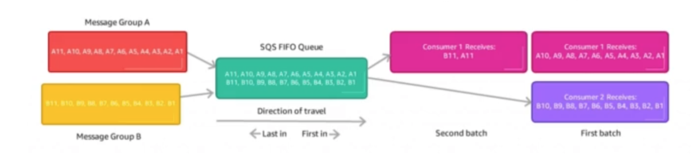

# **Ordering Data into Kinesis.**

Let's use a case study...

* Imagine you have 100 trucks (truck_1, truck_2, ... , truck_100) on the road sneding their GPS positions regularly into AWS.
* We want to consume the data in order for each truck, so that we can track their movement accurately.
* How should we send that data into Kinesis?
* The answer is... using a "Partition Key" value of the "truck_id".
* The same key will always go to the same shard.
* Kinesis hashes partition keys to particular shards.
* That way, data points for truck_1 will always hashed to shard 1, truck_33 may also be hashed to shard 1, truck_64 hashed to shard 2 etc... but this remains for all data future datapoints.

# **Ordering Data into SQS.**

* For SQS standard, there is no ordering.
* For SQS FIF), if you do not use a Group ID, messages are consumed in the order that they are sent, **with only a single consumer**.
* You can scale the number of consumers, but you want messages to be "grouped" when they are related to one-another.
* Here, we would use a Group ID (very similar concept to Partition Keys) in Kinesis.

## **Kinesis vs SQS Ordering.**

* Let's assume our use case is still 100 trucks, but the options for gathering data are either 5 Kinesis Shards, or 1 SQS FIFO Queue.
* Kinesis:
    * On average, you'll have 20 trucks per shard.
    * Trucks will have their data ordered within each shard.
    * The maximum amount of consumers in parallel we can have is 5.
    * Can receive up to 5 MB/s of data.
* SQS FIFO:
    * You can only have 1 SQS FIFO Queue.
    * You will have 100 Group ID's.
    * You can have up to 100 consumers.
    * You can have up to 300 messages per second (or 3000 with batching).