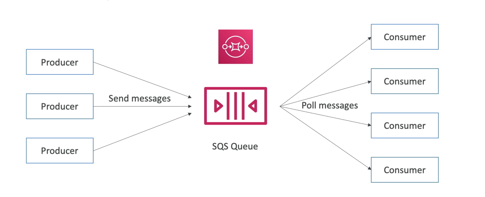
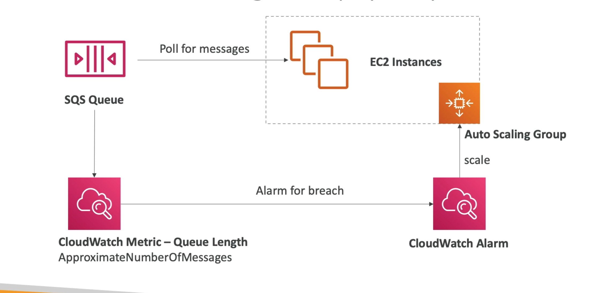
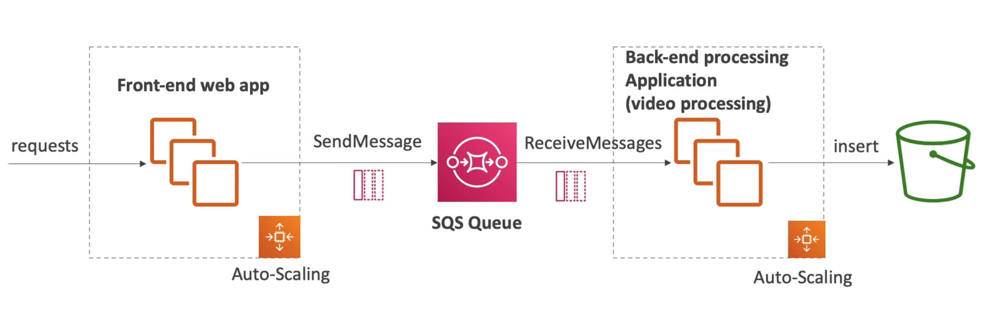

# **SQS Overview.**

SQS stands for Simple Queue Service, and houses messages.

## **What is a queue?**

* A queue houses messages directly from applications called "producers".
* A single SQS queue can have multiple producers that send messages.
* "Consumers" (back-end applications) will poll the queue for new messages.
* These consumers can & will do a wide range of things with these messages (basically whatever you need them to do).
* Once consumed, the consumer will delete the message from the queue.
* SQS is here to be a buffer, or decouple, our services or applications.

## **Standard Queues.**

* Oldest offering.
* Fully managed service, used to decouple applications.
* Attributes include:
    * Unlimited throughput, unlimited number of messages in a queue.
    * Default retention of messages is 4 days, maximum of 14 days.
    * Low latency (<10 ms on publish and receive).
    * Limitation of 256KB per message sent.
* Can have message duplication (at least once delivery).
* Because of this, it's important to process messages in batches & once a particular message has been processed, delete the message using it's unique identifier - think of my Sales Control work in Centrica.
* Can have out of order messages (best effort ordering).

## **Producing Messages.**

* Produced to SQS using the SDK (SendMessage API).
* The message is persisted in SQS until the consumer deletes it.
* e.g. send an order to be processed.
    * Send a message with:
        * Order ID.
        * Customer ID.
        * Any further attributes you might need.
* Max message size of 256KB.
* Unlimited throughput.

## **Consuming Messages.**

* Can be running on EC2 Instances, on-premise servers, **or most commonly, serverless applications on AWS Lambda**.
* Consumer will poll the queue for new messages.
* Can process up-to 10 messages at a time.
* Using our order example, our consumer could insert the sales order into an RDS database such as Aurora or Redshift.
* Delete the messages using the DeleteMessage API.

## **SQS - Multiple Consumers.**

* Consumers can receive and process messages in parallel.
* At least once delivery.
* Best-effort message ordering.
* Consumers will have to delete the messages after processing to avoid other consumers processing the same message.
* We can scale consumers horizontally to improve throughput of processing.

## **SQS with an Auto Scaling Group.**

## **SQS Decoupling Between Tiers.**

The following is a good example of a scalable & robust application architecture.

## **Security.**

* Encryption:
    * In-flight encryption using HTTPS API.
    * At-rest encryption using KMS encryption.
    * Client-side encryption if the client wants to perform encrpyion/decryption itself.
* Access controls - IAM policies can be used to regulate access to the SQS API.
* SQS Access policies:
    * Useful for cross-account access to SQS queues.
    * Useful for allowing other services (SNS, S3...) to write to an SQS queue.