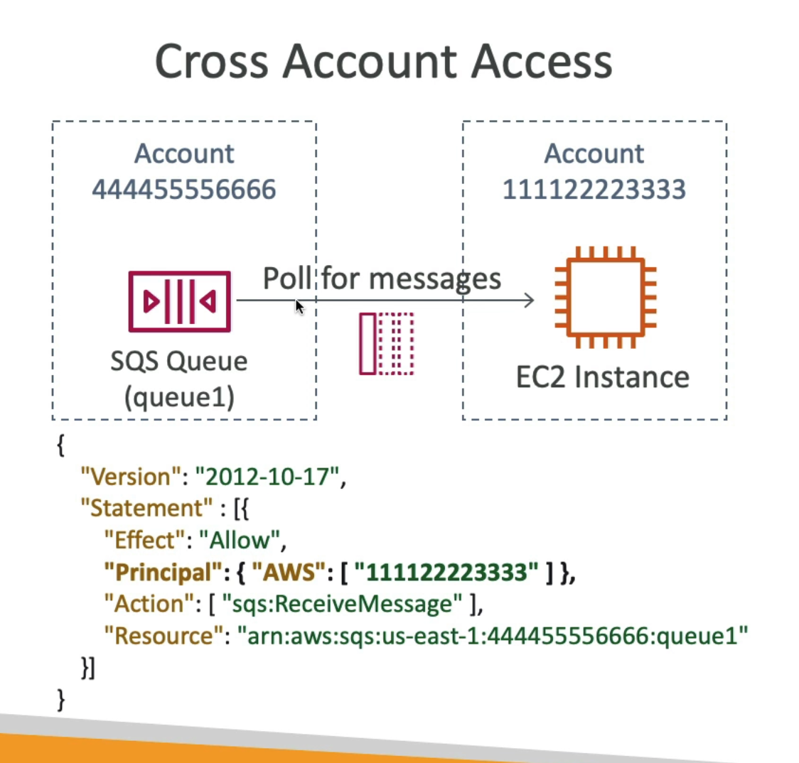
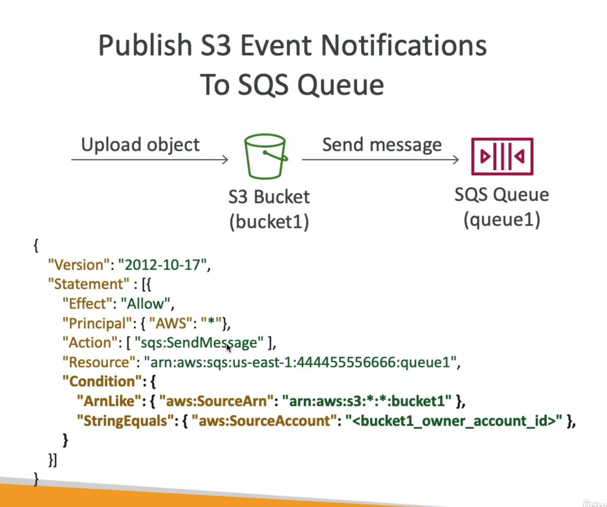

# **SQS Queue Access Policy.**

The two main use cases for SQS queue access policies are:

1). Cross account access:
* We want an application or consumer in another account to poll our queue for messages.

2). Publish S3 event notifications to SQS.

**It's important to have an idea of what these .json policy documents do - the exam can test you on this.**