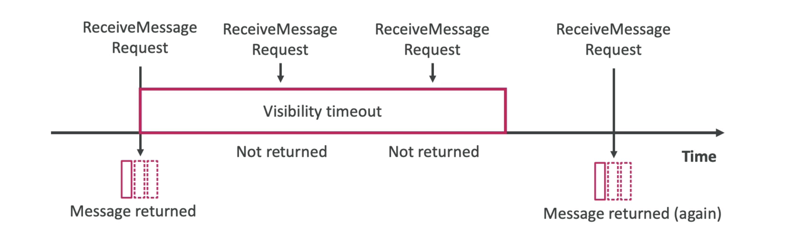

# **SQS Message Visibility Timeout.**

After a message is polled by a consumer, it is invisible to other consumers.

* Default message visibility timeout is 30 seconds.
* That means that the message has 30 seconds to be processed.
* After the message visibility timeout is over, the message is visible in SQS.

* If a message is not processed within the visibility timeout, it will be processed **twice**.
* A consumer could call the ChangeMessageVisibility API to acquire more time to process the message.
* If visibility timeout is high & the consumer crashed, re-processing will take time.
* If the visibility is too low, we may get duplicates.