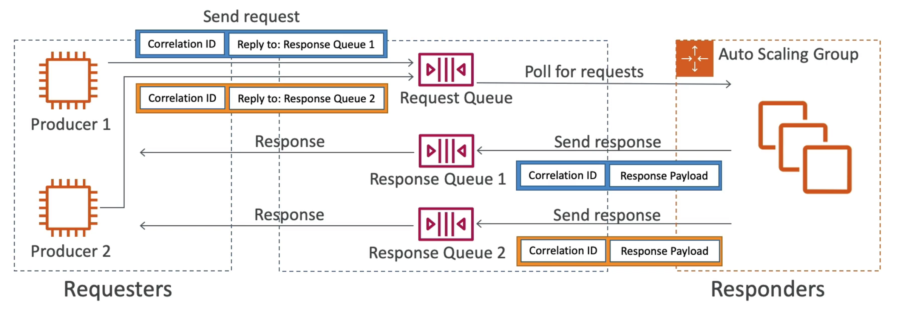

# **SQS Request Response.**

* Here, the producer is requesting a response from the consumer.
* The producer will send a message to an SQS queue from which a consumer will consume the message.
* Based on whether the consumer has successfully consumed the message or not, it will reply to a different SQS queue with a message (i.e. "5xx - Processing Failed" or "2xx - Processing Succeeded").
* From which the original producer will receive the message.
* **To implement this pattern, use something called the SQS Temporary Queue Client**.
* It leverages virtual queues instead of creating / deleting SQS queues (better cost effectiveness).

