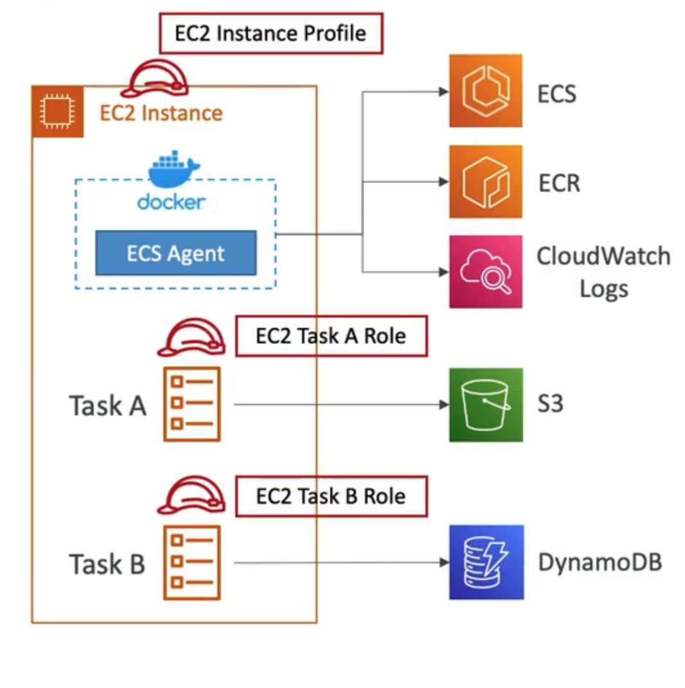

# **ECS Overview.**

ECS stands for Elastic Container Service.

If we want to launch Docker container on AWS, **behind the scenes we will be launching ECS Tasks on ECS clusters**.

## **EC2 Launch Type.**

* With the EC2 launch type, we must provision & maintain the infrastructure of the EC2 instances.
* Each EC2 Instance must run the ECS Agent.
* AWS will take care of starting / stopping containers.
* Docker containers are placed on EC2 instances that we provision in advance.

## Fargate Launch Type.**

* We still want to launch Docker containers on EC2 instances.
* **There are no EC2 instances to provision & manage**.
* It's all serverless.
* We need to create task definitions.
* AWS runs ECS Tasks for you based on the CPU / RAM that you need.
* To scale, we just need to increase the number of tasks.

## **IAM Roles for EC2.**

* EC2 Instance Profiles (for EC2 launch type only):
    * Used by the ECS agent.
    * Makes API calls to the ECS service.
    * Sends container logs to Cloudwatch logs.
    * Pulls Docker images from ECR.
    * References sensitive data stored in Secrets Manager or SSM Parameter Store.
* ECS Task Role:
    * Allows each task to have a specific role.
    * Different roles for different ECS services.
    * Task Role is defined in the task definition.

## **Load Balancer Integrations.**

* Application Load Balancers are supported & works for most use cases.
* Network Load Balancers are also supported but are only recommended for high throughput / high performance use cases, to to pair it with AWS Private Link.
* Elastic Load Balancers are supported but not recommended as we do not get any advanced features or Fargate).

## **Data Volumes (EFS).**

* We want to mount a file system onto our ECS tasks.
* Works for both EC2 & Fargate launch types.
* Tasks running in any AZ will share the same data in the EFS file system.
* Fargate + EFS is a good combination to satisfy serverless containerised computing workloads.
* Use cases:
    * Persistent multi-AZ shared storage for containerised applications.

**Important to Note:**

* FSx for Lustre is not supported.
* Amazon S3 cannot be mounted as a file system.