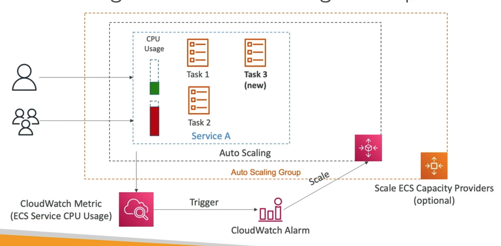

# **ECS Service Auto Scaling.**

* We can automatically increase / decrease the desired number of ECS tasks.
* AWS ECS Auto Scaling uses **AWS Application Auto Scaling**:
    * ECS service average CPU utilisation.
    * ECS service average memory utilisation (scaling on RAM).
    * ALB request count per target (scaling on a metric coming from the ALB).
* Target tracking - scale based on target values for a specific CloudWatch metric.
* Step scaling - scale based on a specific CloudWatch alarm.
* Scheduling scaling - scale based on a specific date/time.
* ECS Service Auto Scaling (task level) =/= EC2 Auto Scaling (EC2 instance level / launch type).
* Fargate Auto Scaling is much easier to setup as it is serverless.

## **Auto Scaling EC2 Instances using the EC2 Launch Type.**

* Accommodate ECS Service Scaling by adding the underlying EC2 instances.
* Auto Scaling Group Scaling:
    * Scaled your ASG based on CPU utilisation.
    * Add EC2 instances over time.
* ECS Cluster Capacity Provider:
    * Used to automatically provision & scale infrastructure for ECS tasks.
* Capacity provider paired with an Auto Scaling Group.
* Add EC2 instances when you're missing capacity.

