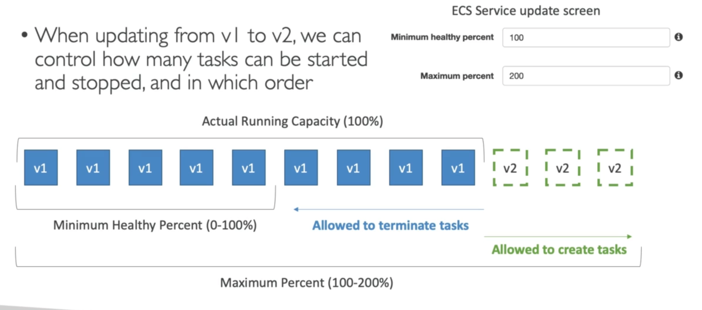

# **Rolling Updates.**

* When updating an ECS service from v1 to v2, we can control how many tasks can be started and stopped, and in which order.
* We can use Minimum / Maximum healthy percentales to allow our service to manage how many old tasks can be terminated (v1) & how many new tasks can be created (v2).

## **Min 50%, Max 100%.**

* Starting number of tasks is 4.
* We will terminate 2 old tasks (v1), before creating 2 new tasks (v2).
* We will then terminate the remaining 2 old tasks (v1), before creating the remaining 2 new tasks (v2).

## **Min 100%, Max 150%.**

* Starting number of tasks is 4.
* We start by creating 2 new tasks (v2).
* We terminate 2 old tasks (v1) before we create 2 more new tasks (v2).
* This occurs once more, before all 4 tasks are our newer versions.