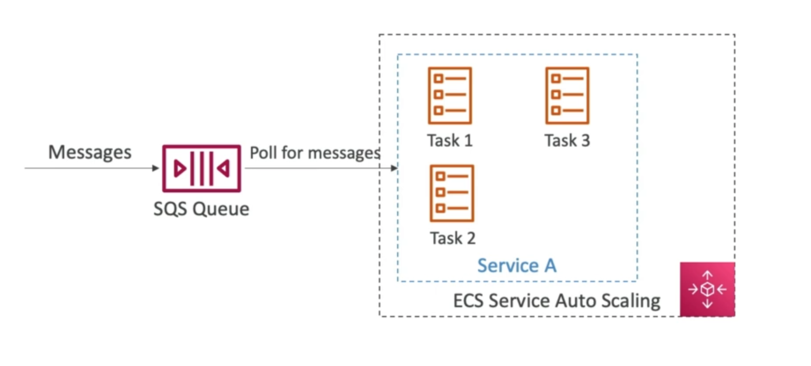

# **ECS Solutions Architectures.**

## **ECS Tasks & EventBridge (S3).**

What if we want ECS tasks to be invoked by EventBridge?

## **ECS Tasks & EventBridge (Schedule).**

What if we want EventBridge to invoke ECS tasks on a schedule?

## **ECS - SQS Queue.**

What if we want our ECS Tasks to act as consumers of an SQS queue?

