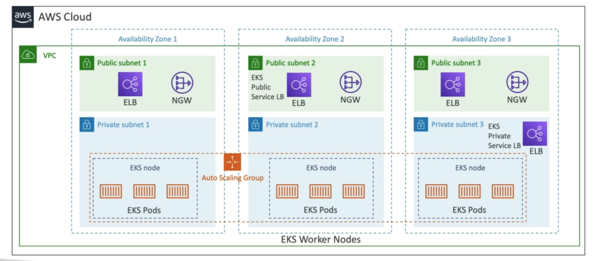

# **Overview.**

EKS stands for Elastic Kubernetes Service.

* It is a way to launch managed Kubernetes clusters on AWS.
* Kubernetes is an open-source system for automatic deployment, scaling & management of containerised (usually Docker) application.
* It's an alternative to ECS, similar purpose but has a different API.
* EKS supports EC2 deployment if you want to deploy worker nodes or Fargate to deploy serverless containers.
* Use case - if your company is already using Kubernetes on-premise or in another cloud & wants to migrate to AWS using Kubernetes.
* **Kubernetes is cloud-agnostic** - meaning it can run in any cloud (AWS, Azure, GCP).
* Sometimes Kubernetes is short-handed to "k8s".
* "EKS Pods" are the equivalent of ECS Tasks.

