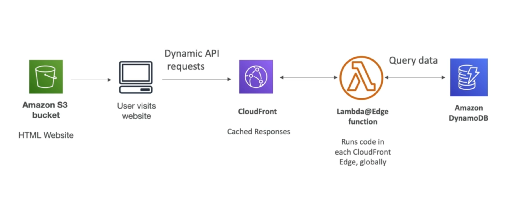

# **Overview.**

* Let's say we have deployed a CDN using CloudFront.
* What if you wanted to run a global AWS Lambda alongside this CDN?
* Or, how would you implement request filtering before reaching your application.

For this, **you can use Lambda@Edge**. This service allows you to deploy Lambda functions alongside your CloudFront CDN. We can:

* Build more responsive applications.
* You do not manage servers, Lambda is deployed globally.
* Customise the CDN content.
* Pay only for what you use.

## **Types of Lambda@Edge.**

* You can use Lambda to change CloudFront requests & responses:
    * After CloudFront receives a request from a viewer (called a viewer request).
    * Before CloudFront forwards the request to the origin (origin request).
    * After CloudFront receives the response from the origin (origin response).
    * Before CloudFront forwards the response to the viewer (viewer response).
* You can also generate responses to viewers without ever sending the request to the origin.

## **Global Application.**

Here is an example of a global application architecture:

## **Use Cases:**

We have the following use cases for Lambda@Edge:

* Website Security & Privacy.
* Dynamic Web Application at the Edge.
* Search Engine Optimisation.
* Intelligent Route Across Origins & Data Centers.
* Bot mitigation at the edge.
* Real-time Image Transformation.
* A/B Testing.
* User authentication & authorisation.
* User prioritisation.
* User tracking & analytics.