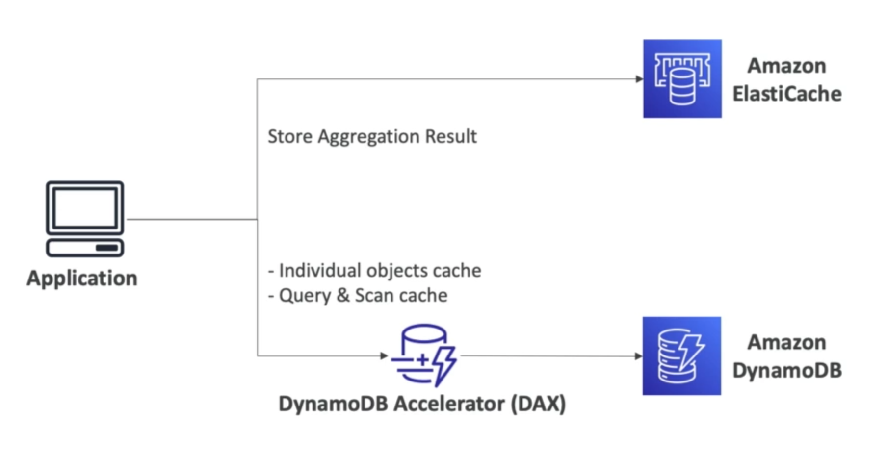
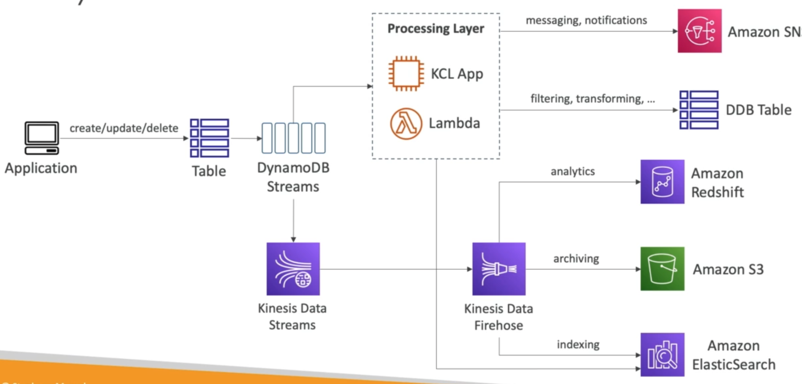
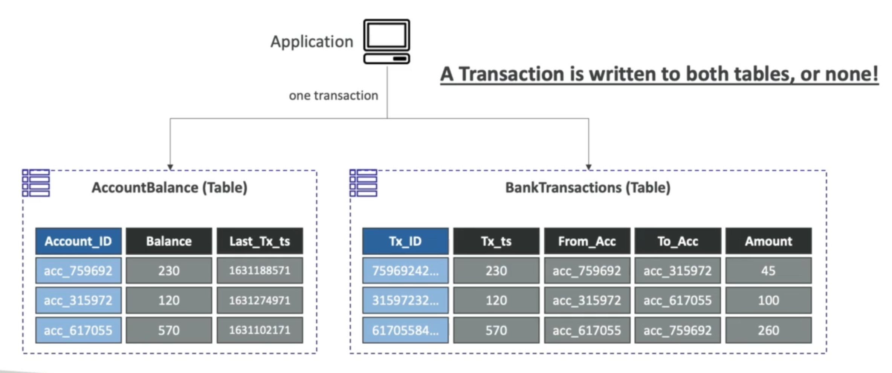

# **Advanced Features of DynamoDB.**

## **DynamoDB Accelerator (DAX).**

* A fully-managed, highly available, seamless in-memory cache for DynamoDB.
* Helps solve read congestion by caching.
* Microseconds latency for cached data.
* Doesn't require application logic modification (compatible with existing DynamoDB APIs).
* 5 minutre TTL for cache (default).

## **DAX vs ElastiCache.**

## **DynamoDB Streams.**

* Ordered stream of item-level modifications (create/update/delete) in a table.
* Stream records can be:
    * Sent to Kinesis Data Streams.
    * Read by AWS Lambda.
    * Read by Kinesis CLient Library applications.
* Data retention for up to 24 hours.
* Use cases include:
    * React to changes in real-time (welcome email to users).
    * Analytics.
    * Insert into derivative tables.
    * Insert into ElasticSearch.
    * Implement cross-region replication.

## **DynamoDB Global Tables.**

* Cross-region tables.
* There is 2-way replication between tables in different AZ's.
* Make DynamoDB tables accessible with low latency in multiple-regions.
* Active-Active replication.
* Apllications can READ & WRITE to the table in any region.
* Must enable DynamoDB Streams as a pre-requisite.

## **DynamoDB TTL.**

* Automatically delete items after an expiry timestamp.
* You could append an extra column to your DynamoDB table with an Epoch timestamp & set a TTL condition to delete old records.
* Use cases:
    * Reduce stored data by keeping current items.
    * Adhere to regulatory obligations.

## **DynamoDB Indexes.**

* Two types:
    * Global Secondary Indexes (GSI).
    * Local Secondary Indexes (LSI).
* High-level - allows querying on attributes other than the Primary Key of the table.

## **DynamoDB Transactions.**

* Allow you to write to tables concurrently (or none at all).

