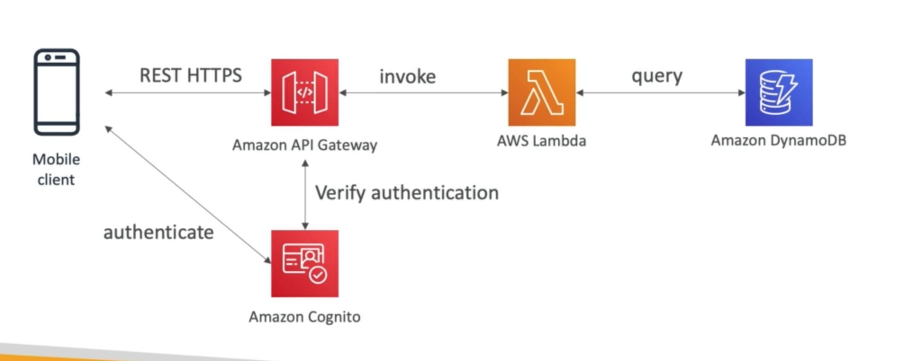
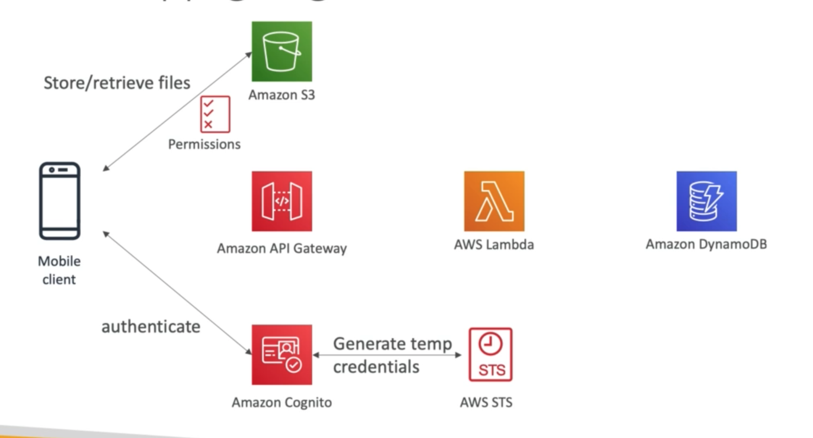
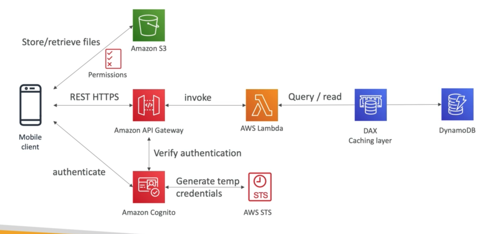

# **Use Case - MyToDoList.**

Let's envision we want to create a mobile application where we can add/delete/modify items on a ToDoList. We want our application to have the following features:

* Expose HTTPS REST API's.
* Serverless.
* Users should be able to interact with their own S3 folder.
* Users should authenticate through a managed serverless service.
* Users should be able to read/write to-do's, but mostly read.
* The database should scale & have some high read throughput.

## **The Solution Architecture.**

### **Basic Overview.**

At a basic level, let's assume our solution looks a little like the following:

### **Cognito - Giving Users S3 Access.**

We can then step this up a notch by giving our users access to their own S3 bucket if they need to by generating temporary credentials:

### **DynamoDB - Improving Read Throughput.**

We can improve read throughput by introducing a DAX Caching Layer:

