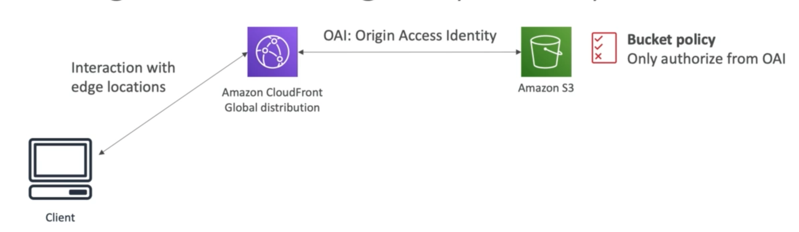
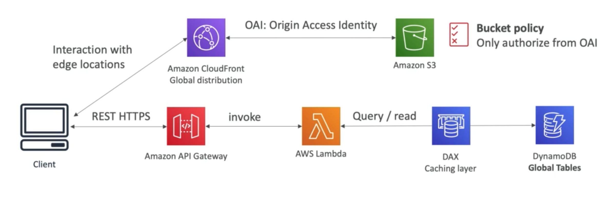
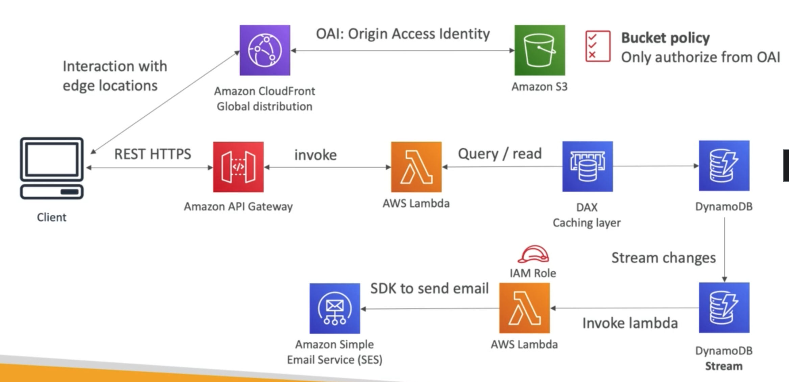
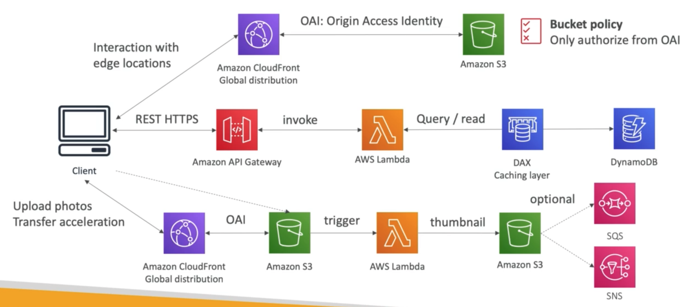

# **Use Case - MyBlog.com.**

In this scenario, we want to create a blogging website, the website should consider:

* Being able to scale globally.
* That blogs are rarely written, but very often read.
* Some of the website is purely static files, but the rest of the website is a dynamic REST API.
* Caching must be implemented where possible.
* Any users that subscribes should receive a welcome email.
* Any photo uploaded to the blog should have a thumbnail generated.

## **The Solution Architecture.**

### **Basic Overview - Static Website.**

At an extremely basic level, our solution architecture for a global static website may look something like the following:

### **Including a REST API.**

We can also include a HTTPS REST API for our website by exposing an API Gateway endpoint as we would classically:

### **Adding the Welcome Email Functionality.**

We can utilise DynamoDB Streams, Lambda & SES to send out a Welcome Email to people who subscribe:

### **Thumbnail Generation.**

For the thumbnail generation functionality, we can again utilise a different S3 bucket & CloudFront Distribution as well as Lambda.

