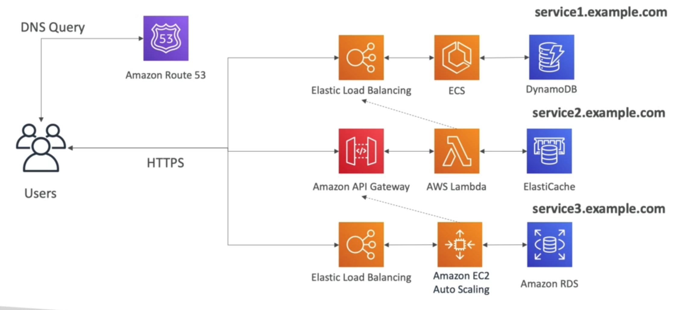

# **Use Case - Microservices.**

Let's now explore common microservice architectures, we should consider:

* Many services interact with each other directly using a REST API.
* Each architecture for each microservice may vary in form & shape.
* Each architecture for each microservice may vary depending on what it offers.
* Microservice archite ture leads to a leaner development lifecycle for each service.

## **The Solution Architecture.**

All of the following examples are purely arbitrary, we won't be going into too much detail on what service they provide, they're just examples.

### **Overview.**

The following diagram outlines 3 potential microservice architectures:

## **Approach Discussion.**

* Microservices are supposed to be free enough to be designed however the user chooses.
* Microservices can follow synchronous & asynchronous patterns.
* Challenges with microservice architecture:
    * Repeated overhead for creating each new microservice.
    * Issues optimising server density / utilisation.
    * Complexity of running multiple versions of multiple microservices simultaneously.
    * Proliferation of client-side code requirements to integrate with many separate services.
* Some of this challenges are solved with Serverless:
    * API Gateway, Lambda scale automatically & are pay-per-usage.
    * You can easily clone API's & environments.
    * Generated client SDK through Swagger integration for API Gateways.