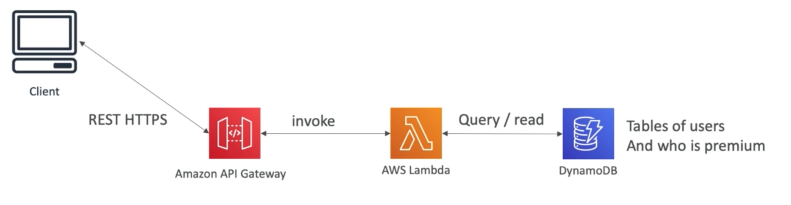
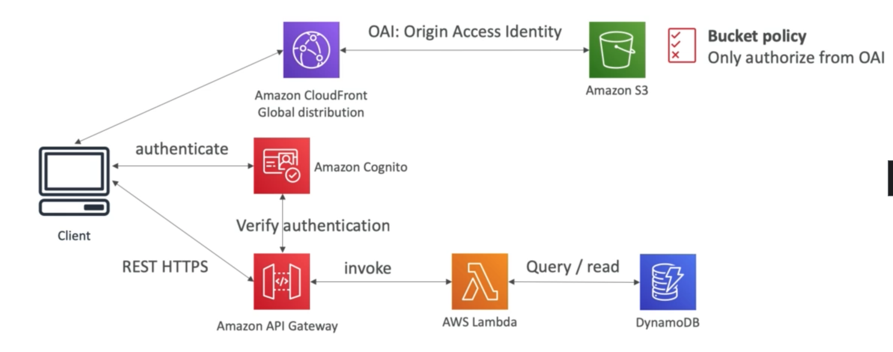
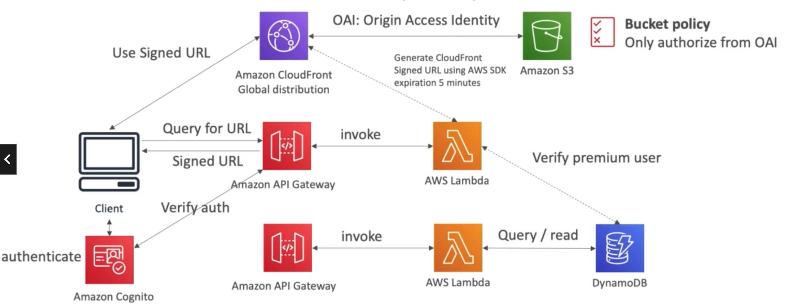

# **Use Case - Distributing Paid Content.**

Now, let's explore distributing paid content that we own (such as videos):

* Users can pay for content.
* Each video can be bought by many different customers.
* We only want to distribute videos to users who are premium users.
* We have a database of premium users.
* Links we send to premium users should be short lived.
* Our application should be global.
* We want our solution to be fully serverless.

## **The Solution Architecture.**

### **Basic Overview - Premium Users & Authentication.**

Our solution architecture allowing users to sign up for premium may look something like:

### **Adding A Video Storage Service.**

Now let's add a video storage service with CloudFront & S3:

### **Ensuring only Premium Users can access videos.**

We can use pre-signed URL's & a Lambda function to add this functionality:

