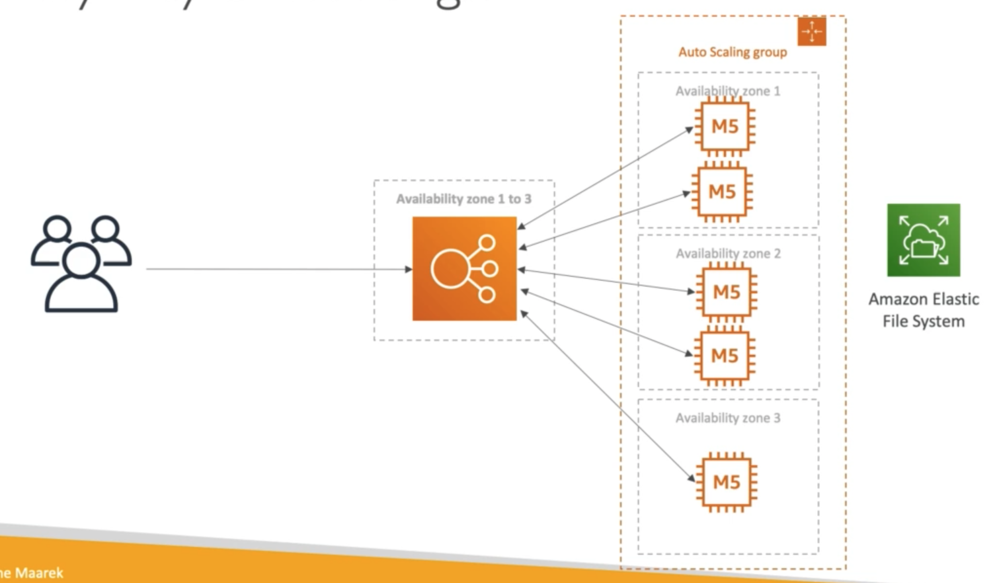
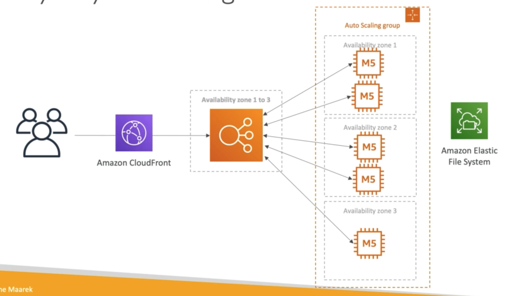

# **Use Case - Software Updates Offloading.**

Let's envision we have an application on EC2 that distributes software updates once in a while:

* When a new software update is out, we get a lot of requests & the content is distributed in mass over the network, which is very costly.
* We don't want to change our application, but we want to optimise our cost & CPU - how can we do that?

## **The current state of our Application.**

Let's assume our current application architecture looks like the following:

## **The Solution Architecture.**

We can fix the above CPU issues & optimise our cost really easily by implementing the below:

## **Why CloudFront?**

* No changes to the existing architecture.
* Will cache software update files at the edge.
* The software update files are not dynamic, they're static (non-changing).
* Our EC2 instances aren't serverless.
* But CloudFront is & will scale for us.
* Our ASG will not scale as much, meaning we'll save tremendously in EC2.
* We will also save in availability, network bandwidth cost etc.
* Remember - CloudFront is an easy way to make an existing application more scalable & cheaper for static content.