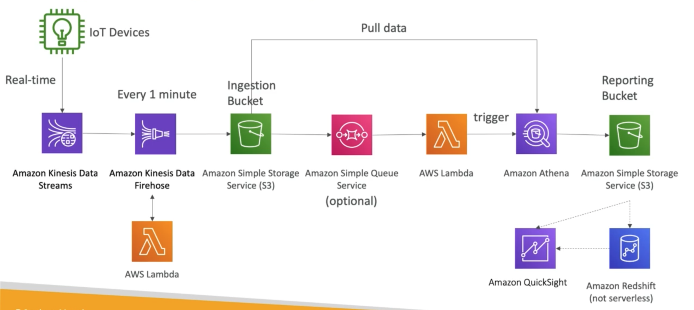

# **Use Case - Big Data Ingestion Pipeline.**

We now want to implement a fully serverless, big data ingestion pipeline.

* We want to collect data in real-time.
* We want to transform the data.
* We want to query the transformed data using SQL.
* The reports created using the queries should be in S3.
* We want to load that data into a warehouse & create dashboards.

## **The Solution Architecture.**

Let's presume the data source is IoT devices (we can manage these using a service called IoT Core), then maybe our solution architecture may look something a little like the following:

