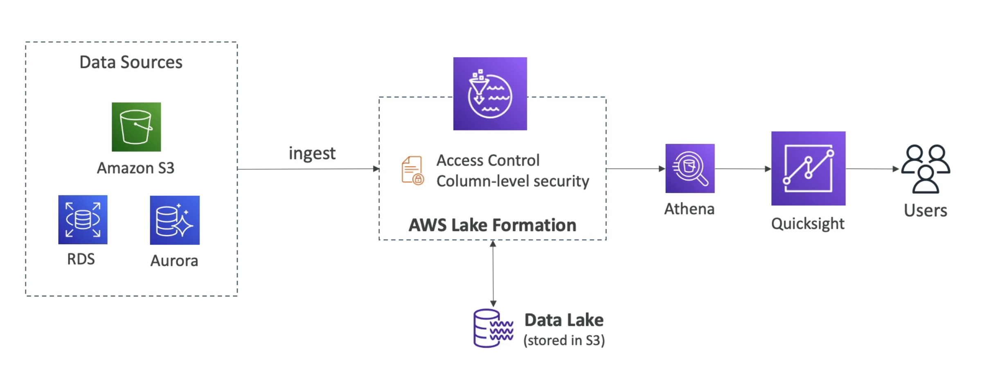

# **Lake Formation.**

* Data lake is a central place to have all of your data in one place for analytical purposes.
* Fully managed service that makes it easy to setup data lakes in days.
* Discover, cleanse, transform & ingest data into your data lake.
* Can automate many complex manual steps such as collecting, cleansing, moving, cataloging, etc... data.
* Can automate de-duplicating data using ML Transforms.
* Combine both structured & un-structured data in your data lake.
* Out of the box blueprints can be used for S3, RDS, NoSQL DB's...
* Fine-grained access controls for applications (row & column level access).
* Lake Formation is built on top of Glue.

## **Centralised Permissions Example.**

