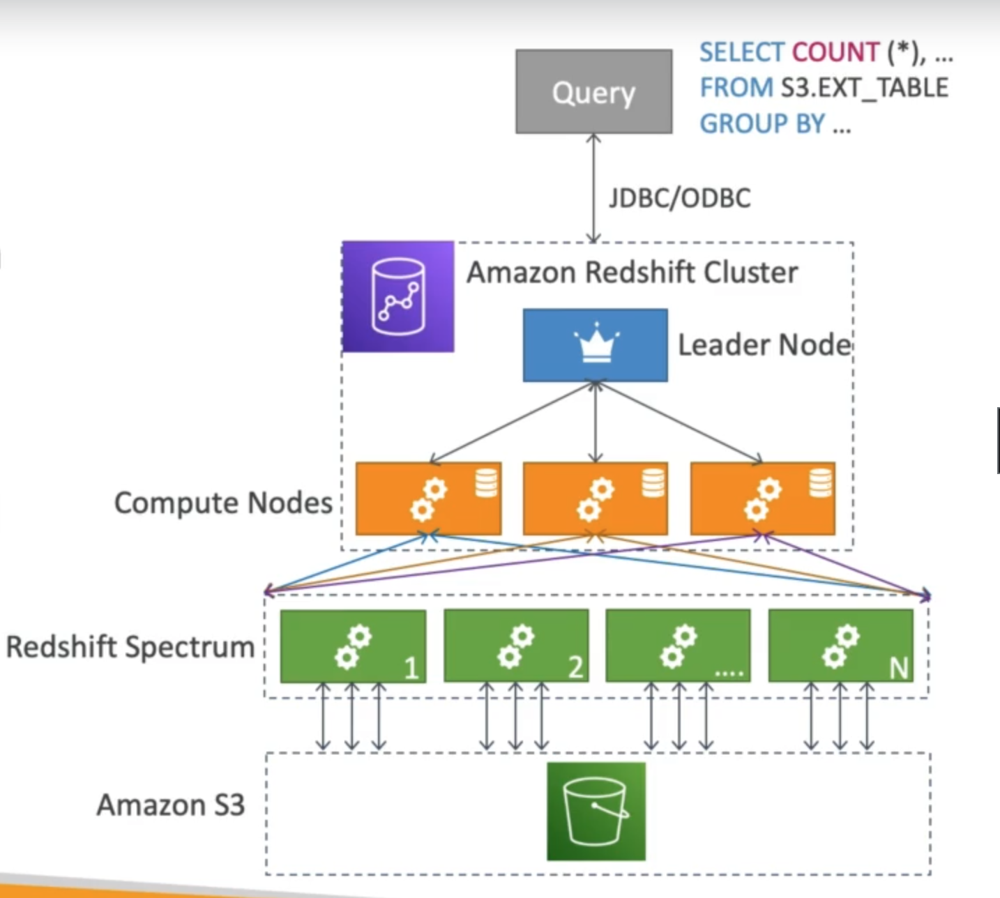

# **Redshift.**

* Redshift is based on PostgreSQL, but it is not used for OLTP.
* It's instead used for OLAP - Online Analytical Processing (analytics & data warehousing).
* 10x better performance that other data warehouses, can scale to PB's of data.
* Columnar storage of data (instead of row based).
* Massively Parallel Query Execution (MPP).
* Pay as you go based on the instances provisioned.
* Has a SQL interface for performing queries.
* BI tools such as AWS Quicksight or Tableau integrate with it.
* Data is loaded from S3, DynamoDB, DMS, other DBs...
* From 1 node to 128 nodes, up to 128 TB of space per node.
* Has different node architecture:
    * Leader node - for query planning, results aggregation.
    * Compute node - for performing queries, sending results to the leader.
* Redshift Spectrum - perform queries directly against S3 (no need to load).
* Backup & restore.
* Security - VPC / IAM / KMS.
* Monitoring functionality.
* Redshift Enhanced VPC Routing - COP / UNLOAD commands go straight through the VPC (not the internet).

## **Snapshots & Disaster Recovery.**

* **Redshift has no multi-AZ mode**.
* Snapshots are point-in-time backups of a cluster, stored internall in S3.
* Snapshots are incremental (only what has changed is saved).
* You can restore snapshots into a new cluster.
* Snapshots can be:
    * Automated - every 8 hours, every 5GB, or on a schedule. You can also set the retention period of said snapshots.
    * Manual - snapshot is retained until you delete it.
* **You can configure Redshift to automatically copy snapshots (automated or manual) of a cluster into another AWS region**.

## **Loading Data into Redshift.**

There are 3 different methods for ingesting data into Redshift:

* Kinesis Firehose - you can drive data straight into your Redshift database using Firehose.
* COPY Command - if data persists in S3, you can use the COPY command from the DB itself (must use an IAM role).
    * This can be done through the internet.
    * Or can be done internally through your VPC.
* An EC2 Instance can write data directly into Redshift using the appropriate JDBC driver & an application.

## **Redshift Spectrum.**

* Query data that is already in S3 without loading it.
* **Must have a Redshift cluster available to start the query**.
* The query is then submitted to thousands of Redshift Spectrum nodes.

## **Redshift for Solutions Architects.**

* **Operations** - small downtime when failover happens, when maintenance happens, scaling in read replicas / EC2 Instances / restore EBS implies manual intervention, application changes.
* **Security** - AWS is responsible for OS security, we are responsible for setting up KMS, security groups, IAM policies, authorising DB users, using SSL etc.
* **Reliability** - auto healing features, can automatically copy snapshots across regions.
* **Cost** - pay per node provisioned, 1/10th of the cost vs other data warehouses.
**vs Athena** - better performance for queries, joins & aggregations thanks to indexing.

**Redshift = Analytics / BI / Data Warehouse**.