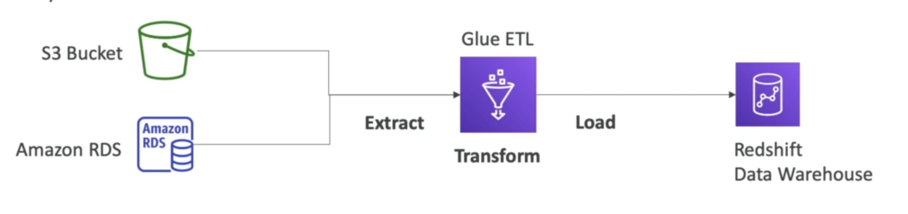

# **Glue.**

* Glue is a managed ETL service.
* Useful to prepare & transform data for analytics.
* Fully serverless service.

## **Glue Data Catalog.**

* The Glue Data Catalog is a metadata catalog of all available datasets.

## **Things to know at a high-level.**

* Glue Job Bookmarks - prevent re-processing old data.
* Glue Elastic Views:
    * Combine & replicate data across multiple data stores using SQL.
    * No custom code, Glue monitors for changes in the source data, is serverless.
    * Leverages a "virtual table" (materialised view).
* Glue DataBrew - clean & normalise data using pre-built transformations.
* Glue Studio - new GUI to create, run & monitor ETL jobs in Glue.
* Glue Streaming ETL (built on top of Apache Spark) - compatible with Kinesis Data Streams, Kafka, Managed Kafka.