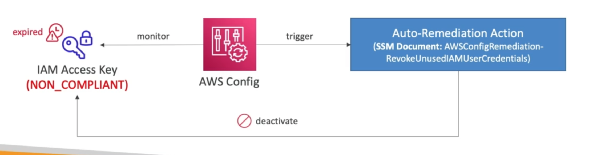
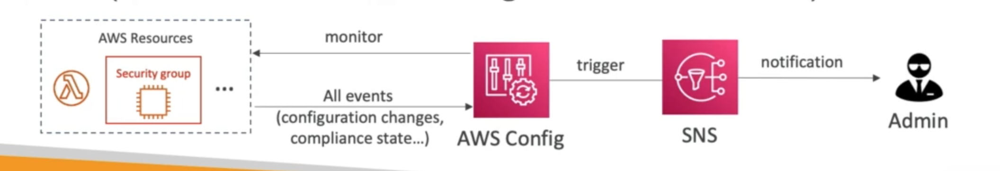

# **AWS Config.**

* Helps with auditing & recording compliance of your AWS resources.
* Helps record configurations & changes over time.
* Questions that can be solved by AWS Config:
    * Is there unrestricted SSH access to my security groups?
    * Do my buckets have any public access?
    * How has my ALB config changed over time?
* You can receive alerts (via SNS) for any changes.
* AWS Config is a per-region service.
* Can be aggregated across regions & accounts.
* Possibility of storing configuration data into S3 (where it can again be analysed by Athena).

## **Config Rules.**

* Can use AWS managed config rules.
* Can make custom config rules (defined by Lambda).
    * e.g. evaluate if each EBS disk is of type gp2, evaluate if each EC2 instance is t2.micro.
* Rules can be evaluated / triggered:
    * For each config change.
    * And / or at regular time intervals.
* **AWS Config Rules do not prevent actions from happening - it is purely used for complaince purposes.**
* There's no free tier for AWS Config & it can get quite expensive quite quickly.

## **Config Resource.**

* View the compliance of a particular resource over time.
* View the configuration of a particular resource over time.
* View CloudTrail API calls of a resource over time.

## **Remediations.**

* Automate remediation of non-compliant resources using SSM Automation Documents.
* Use AWS-Managed Automation Documents or create custom Automation Documents (tip - you can create custom Automation Documents that will invoke a Lambda function).
* You can set **Remediation Retries** if the resource is still non-compliant after auto-remediation.

## **Notifications.**

* Can use EventBridge to trigger notifications when AWS resources are non-compliant.

* Ability to send configuration changes & compliance state notifications to SNS (all events - using SNS Filtering or filtering on the client-side).

