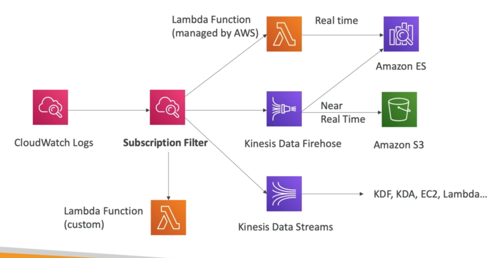
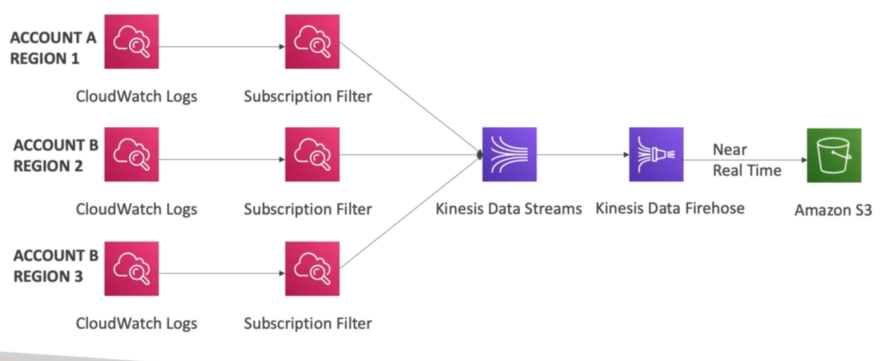

# **CloudWatch Logs.**

* Logs are categorised into **log groups**, this is an arbitrary name that usually represents an application.
* These are further broken down into **log streams**, these are instances with the application / log files / application (usually broken down into time intervals).
* Can define log expiration policies (never expire, 30 days etc.).
* CloudWatch logs can be exported to:
    * S3.
    * Kinesis Data Streams.
    * Kinesis Data Firehose.
    * Lambda.
    * ElasticSearch.

## **Log Sources.**

* SDK, CloudWatch Logs Agent, CloudWatch Unified Agent.
* Elastic Beanstalk - collection of logs from an application.
* ECS - collection of logs from containerised applications.
* Lambda - collection of logs direct from the function.
* VPC Flow Logs - VPC specific logs.
* API Gateway.
* CloudTrail based on filter.
* Route53 - will log all the DNS queries.

## **Metric Filter & Insights.**

* CloudWatch logs can use filter expressions:
    * We can find a specific IP inside of a log.
    * We can count the occurrences of "ERROR" logs.
* Metric filters can be used to trigger CloudWatch alarms.
* CloudWatch Logs Insights can be used to query logs & add queries to CloudWatch dashboards.

## **S3 Export.**

* Log data can take up to 12 hours to become available for export.
* The API call is called CreateExportTask.
* Not near-real-time or real-time...

## **Log Subscriptions.**

* For near-real-time log processing.

## **Aggregation - Multi-Account & Multi-Region.**

