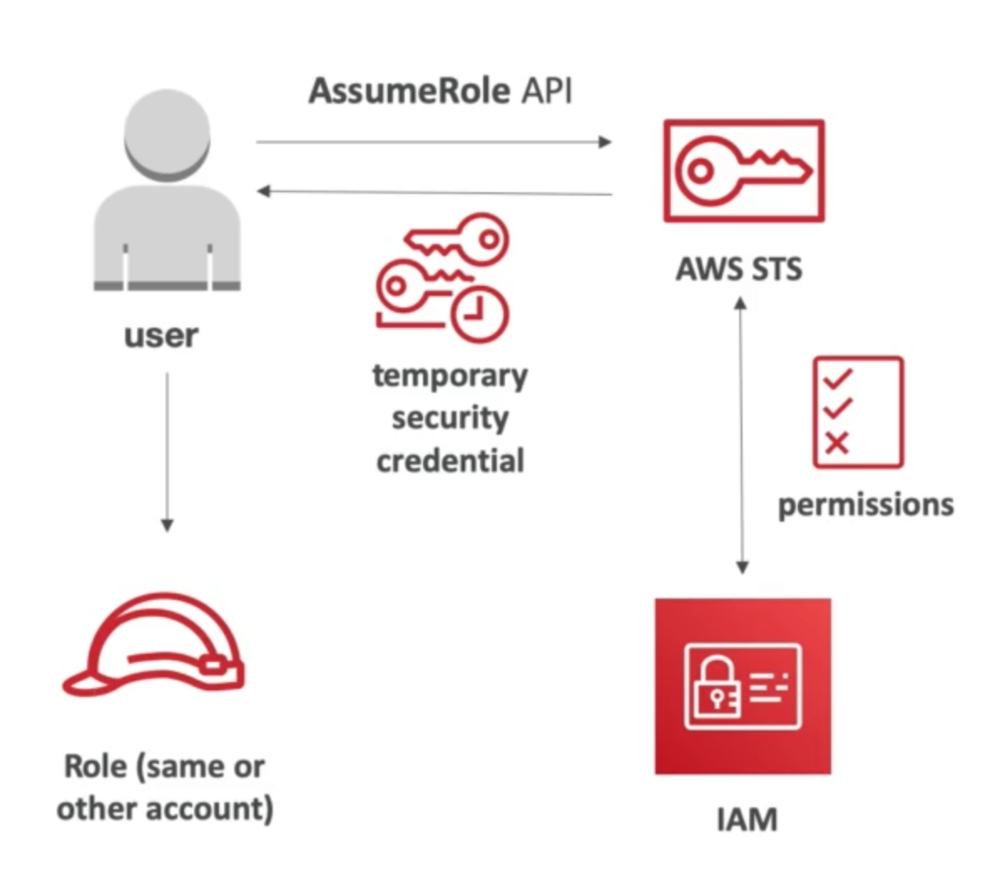

# **Security Token Service (STS).**

* Allows to grant limited & temporary access to AWS resources.
* Token is valid for up to one hour (must be refreshed).
* **AssumeRole**:
    * within your own account for enhanced security.
    * cross account access - assume a role in a target account to perform actions there.
* **AssumeRoleWithSAML**:
    * return credentials for users logged in with SAML.
* **AssumeRoleWithWebIdentity**:
    * return credentials for users logged in with an identity provider (IdP) such as Facebook, Google etc.
    * AWS recommends against using this & using Cognito instead.
* **GetSessionToken**:
    * for MFA, from a user or an AWS account root user.

## **Using STS to Assume a Role.**

* Define an IAM role within your account or cross-account.
* Define with principals can access this IAM role.
* Use AWS STS to retreive credentials & impersonate the IAM tole you have access to (AssumeRole API).
* Temporary credentials can be valid between 15 minutes to 1 hour.

