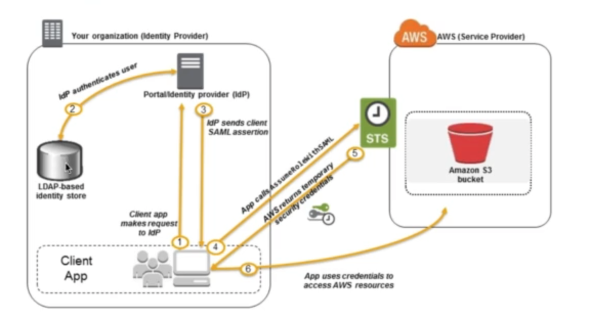
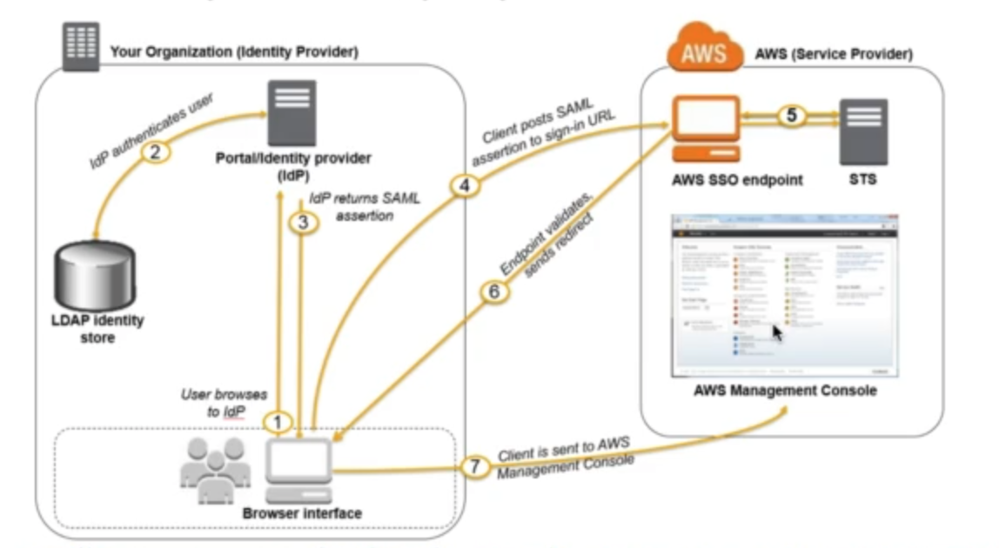
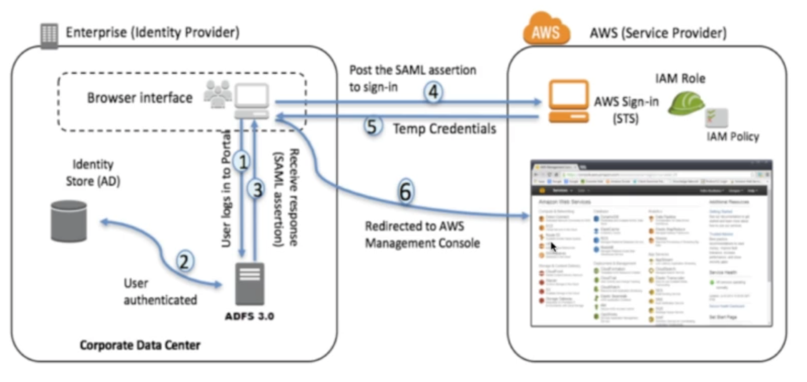
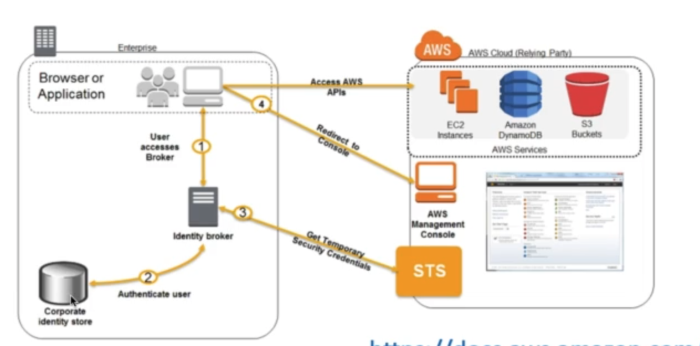
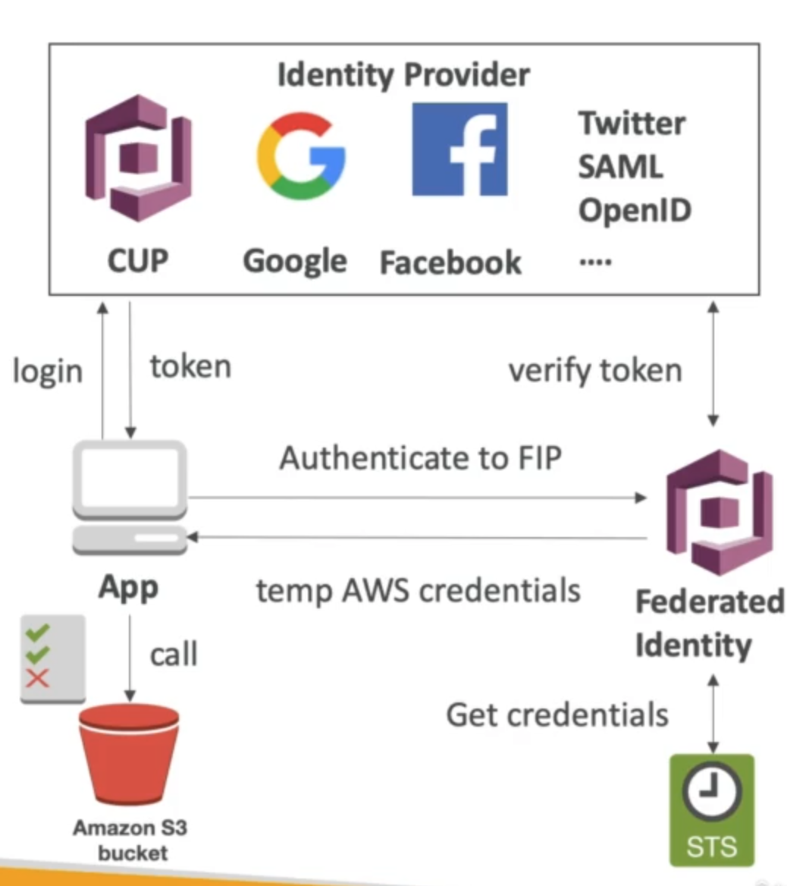

# **Identity Federation in AWS.**

* Federation lets users outside of AWS to assume temporary roles for accessing AWS resources.
* These users assume identity provided access role.
* Federations may have many flavors:
    * SAML 2.0.
    * Custom Identity Broker.
    * Web Identity Federation with Cognito.
    * Web Identity Federation without Cognito.
    * Sign Sign On.
    * Non-SAML with AWS Microsoft AD.
* **Using federation, you don't need to create IAM users.**

## **SAML 2.0.**

* To integrate with Active Directory / ADFS with AWS.
* Provides access to AWS Console or CLI (through temporary creds).
* No need to create an IAM user for each of our employees.
* Needs to setup a trust between AWS IAM & SAML (both ways).
* SAML 2.0 enables web-based, cross domain SSO.
* Uses the STS API - AssumeRoleWithSAML.
* Federation through SAML is the "old way" of doing things.
* Amazon Single Sign On (SSO) Federation is the new managed & simpler way.

### **SAML Authentication using the CLI.**

### **SAML Authentication using the Console.**

### **SAML with ADFS (Active Directory FS).**

* Same process as with any SAML 2.0 compatible IdP.

## **Custom Identity Broker Application.**

* Use only if identity provider is not compatible with SAML 2.0.
* The identity broker must determine the appropriate IAM policy.
* Uses the STS API - AssumeRole or GetFederationToken.

## **Web Identity Federation.**

* Not recommended by AWS - use Cognito instead (allows for anonymous users, data synchronisation, MFA).
* Uses AssumeRoleWithWebIdentity API call.

## **Cognito.**

* Goal:
    * Provide direct access to AWS resources from the client side (mobile, web app).
* Example:
    * Provide (temporary) access to write to S3 bucket using Facebook login.
* Problem:
    * We don't want to create IAM users for our app users.
* How:
    * Log in to federated identity provider - or remain anonymous.
    * Get temporary AWS credentials back from the Federated Identity Pool.
    * These credentials come with a pre-defined IAM policy stating their permissions.

