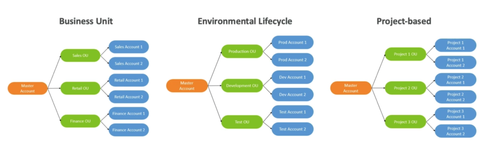
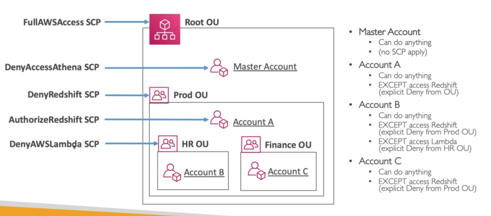

# **Organisations.**

* Global service.
* Allows you to manage multiple AWS accounts.
* The main account is the master account - you cannot change it.
* Other accounts are member accounts.
* Member accounts can only be part of one organisation.
* Consolidated billing across all accounts with a single payment method.
* Pricing benefits from aggregated usage (volume discount for EC2, S3 etc...)
* API is available to automate AWS account creation.

## **Multi-Account Strategies.**

* Create accounts per department.
* Create accounts per cost-centre.
* Create accounts per environment (sandbox / dev / prod).
* Based on regulatory restrictions.
* For better resource isolation.
* To have a separate per-account service limit.
* Isolated account for logging.

There is a difference between multi-account & one account with multi-VPC.

* Use tagging for billing purposes.
* Enable CloudTrail on all accounts.
* Establish cross-account roles for admin purposes.

## **Organisational Units.**

## **Service Control Policies (SCP).**

* Whitelist or blacklist IAM actions.
* Look exactly like IAM policies.
* Applied at the OU or account level.
* Does not apply to the master account.
* SCP is applied to all the Users & Roles of the account, including the root.
* The SCP does not affect service-linked roles.
    * Service-linked roles enable other AWS services to integrate with AWS Organisations & can't be restricted by SCP's.
* SCP must have an explicit allow (does not allow anything by default).
* Use cases:
    * Restrict access to certain services (e.g. in my dev. account I cannot use ECR).
    * Enforce PCI compliance by explicitly disabling services.

**Note on the above - we apply the SCP to the OU as well as the specific Accounts, however, the SCP from the OU take precedence over the SCP applied to the account... hence why the master account can still do anything even though it has a deny access to Athena SCP attached to it.**

## **Moving Accounts.**

To migrate accounts from one organisation to another:

1). Remove the member account from the old organisation.

2). Send an invite to the new organisation.

3). Accept the invite to the new organisation from the member account.

If you want the master account of the organisation to also join a new organisation:

1). Remove the member accounts from the organisations using the procedure above.

2). Delete the old organisation.

3). Repeat the process above to invite the old master account to the new organisation.