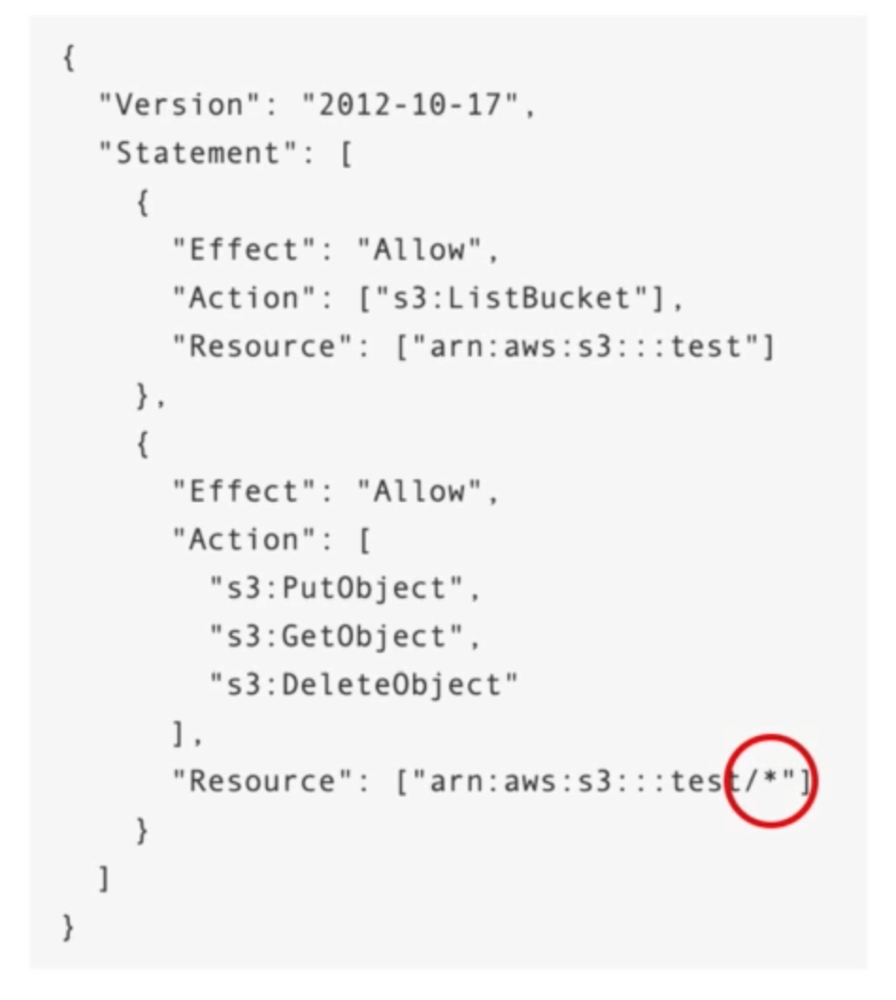

# **IAM Advanced.**

## **IAM Conditions.**

* Can make IAM policies more restrictive based on specific conditions.
* Examples:
    * aws:SourceIP - restrict the client IP from which the API calls are being made.
    * aws:RequestedRegion - restrict the region the API calls are made to.
    * Restrictions based on specific tags.
    * Give permissions to specific actions by forcing MFA.

## **IAM for S3.**

Using the following example:

* ListBucket permission applies to "arn:aws:s3:::test".
    * This is a bucket level permission.
* GetObject, PutObject & DeleteObject applies to the objects within the bucket "arn:aws:s3:::test/\*"
    * These are object level permissions.

## **IAM Roles vs Resource Based Policies.**

* Attach a policy to a resource (i.e. an S3 bucket policy) vs attaching of a role as a proxy.
* When you assume a role (user, application or service), you give up your original permissions & take the permissions assigned to the role.
* When using a resource based policy, the principal doesn't have to give up his permissions.
* e.g. User in account A needs to scan a DynamoDB table in account A & dump it in an S3 bucket in account B:
    * The user in account B would give the S3 bucket a resource based policy that allows the role from account A to put objects "PutObject" into that S3 bucket.
    * Creating a role to consume here wouldn't suffice, as the user would lose the ability to read from the DynamoDB table in account A (without having a place to store the data read from DynamoDB).
* Resource based policies are supported by:
    * S3 buckets.
    * SNS topics.
    * SQS queues.