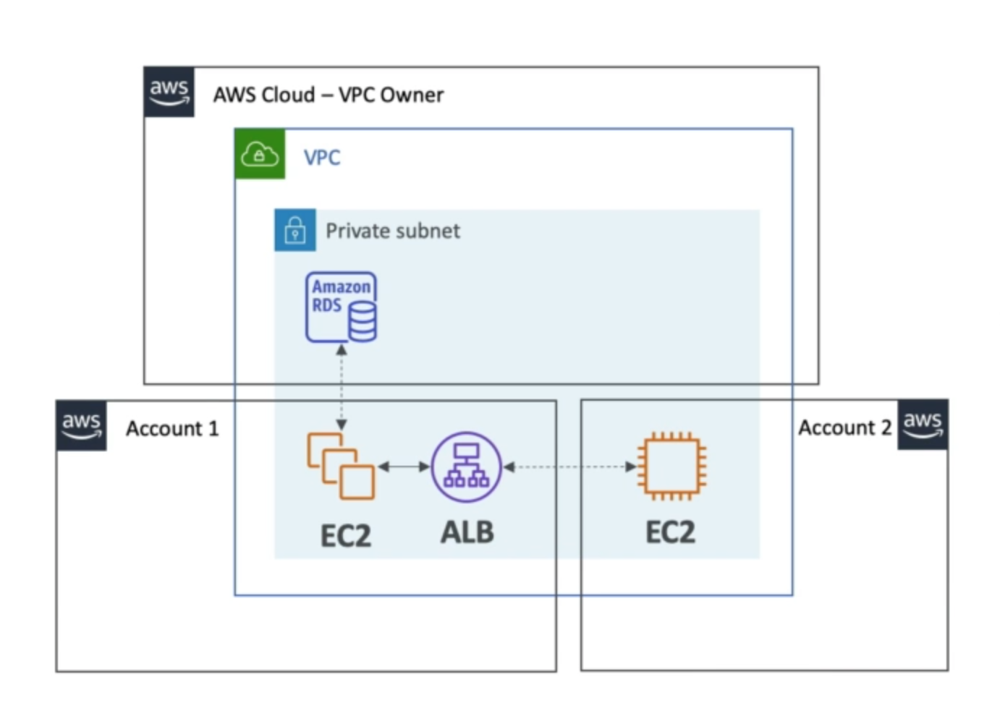

# **Resource Access Manager (RAM).**

* Share AWS resources that you own with other AWS accounts.
* Share with any account or within your organisation.
* Avoid resource duplication.
* What can we share?
    * VPC Subnets.
        * Allow to have all the resources launched in the same subnets.
        * Must be from the same AWS organisation.
        * Cannot share security groups & default VPC.
        * Participants can manage their own resources in there.
        * Participants can't view, modify or delete resources that belong to other participants or the owner.
    * Transit Gatways.
    * Route53 Resolver Rules.
    * License Manager Configurations.

## **VPC Example.**

* Each account:
    * Is responsible for its own resources.
    * Cannot view, modify or delete other resources in other accounts.
* Network is shared, so:
    * Anything deployed in the VPC can talk to other resources in the VPC.
    * Applications are accessed easily across accounts, using the Private IP.
    * Security groups from other accounts can be referenced for maximum security.