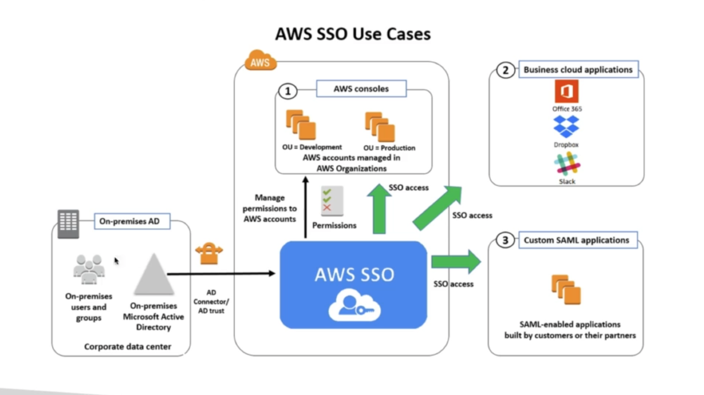
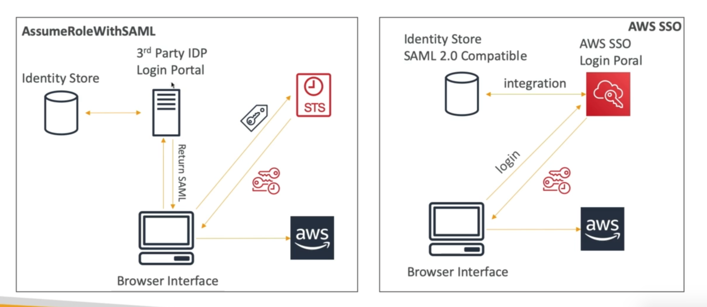

# **Single Sign On (SSO).**

* **This is now called AWS IAM Identity Center.**
* Centrally manage Single Sign-On to access multiple accounts & 3rd party business applications.
* Integrated with AWS Organisations.
* Supports SAML 2.0 markup.
* Integration with on-premise Active Directory.
* Centralised permission management.
* Centralised auditing with CloudTrail.

## **SSO vs AssumeRoleWithSAML.**

