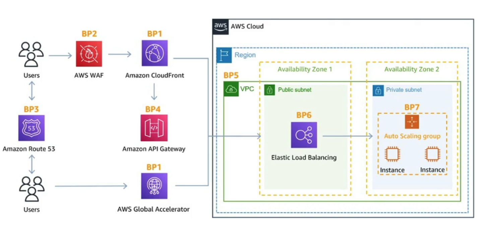

# **DDoS Protection Best Practices.**

## **Protection at the Edge (BP1 & BP3).**

* BP1 - CloudFront:
    * Web application delivery at the edge.
    * Protected from DDoS common attacks (SYN floods, UDP reflection, etc...).
* BP1 - Global Accelerator:
    * Access to your application from the edge.
    * Integration with Shield for DDoS protection.
    * Helpful if your backend is not compatible with CloudFront.
* BP3 - Route 53:
    * Domain Name Resolution (DNS) at the edge.
    * DDoS protection mechanism.

## **Infrastructure layer defence (BP1, BP3 & BP6).

* Global Accelerator, Route 53, CloudFront, Elastic Load Balancing all protect EC2 against high traffic.
* BP7 - EC2 with Auto Scaling:
    * Helps scale in case of sudden traffic surges including a flash crowd or a DDoS attack.
* BP6 - Elastic Load Balancing:
    * Elastic Load Balancing sclaes with the traffic increases & will distribute the traffic to many EC2 instances.

## **Application layer defence (BP1, BP2 & BP6).**

* BP1 & BP2 - detecting & filtering malicious web requests:
    * CloudFront caches static content & serves it from edge locations, protecting the back-end.
    * WAF is used on top of CloudFront & ALB's to filter & block requests based on request signatures.
    * WAF rate-based rules can automatically block the IPs of bad actors.
    * Use managed rules on WAF to block attacks based on IP reputation, or block anonymous IPs.
    * CloudFront can block specific geographies.
* BP1, BP2 & BP6 - Shield Advanced:
    * Shield Advanced automatic application layer DDoS mitigation automatically creates, evaluates & deploys AWS WAF rules to mitigate layer 7 attacks.

## **Attack Surface Reduction (BP1, BP4 & BP6).**

* CloudFront, API Gateway & Elastic Load Balancing all help in obfuscating (hiding) AWS resources (BP1, BP4 & BP6):
* BP5 - Security Groups & Network ACLs:
    * Use security groups & NACLs to filter traffic based on specific IP at the subnet or ENI level.
    * Elastic IP are protected by AWS Shield Advanced.
* BP4 - Protecting API Endpoints:
    * Hide EC2, Lambda elsewhere.
    * Edge-optimised mode or CloudFront regional mode (more control for DDoS).
    * WAF + API Gateway - burst limits, headers filtering, API keys.