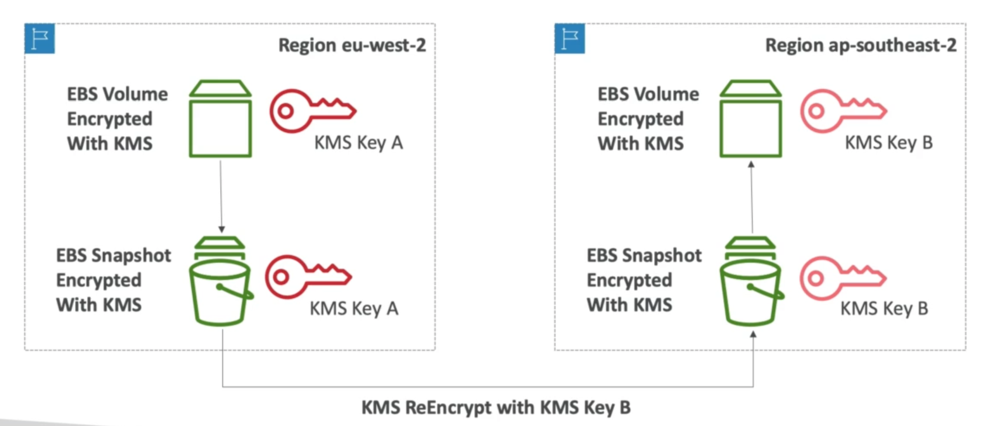

# **Key Management Service (KMS).**

* Anytime you hear "encryption" for an AWS service, it's most likely KMS.
* Easy way to control access to your data, AWS manages keys for us.
* Fully integrated with IAM for authorisation.
* Seamlessly integrated into:
    * EBS - encrypt volumes.
    * S3 - server side encryption of objects.
    * Redshift - encryption of data.
    * RDS - encryption of data.
    * SSM - encryption of parameter store.
    * .
    * .
    * .
* Can also use the CLI / SDK.

## **Customer Master Key (CMK) Types.**

* Symmetric (AE-256 keys).
    * First offering of KMS, single encryption key that is used to encrypt & decrypt.
    * AWS services that are integrated with KMS use Symmetric CMKs.
    * Necessary for envelope encryption.
    * You never get access to the key unencrypted (must call the KMS API to use).
* Asymmetric (RSA & ECC key pairs):
    * Public (encrypt) & private (decrypt) key pairs.
    * Used to encrypt/decrypt or sign/verify operations.
    * The public key is downloadable, but you can't access the Private Key unencrypted.
    * Use case - encryption outside of AWS by users who can't call the KMS API.

## **KMS.**

* Able to fully manage the keys & policies:
    * Create.
    * Rotation Policies.
    * Disable.
    * Enable.
* Able to audit key usage using CloudTrail.
* Three types of Customer Master Keys (CMKs):
    * AWS Managed Service Default CMK - free of cost.
    * User keys created in KMS - $1 per month.
    * User keys imported (must be 256-bit symmetric key) - $1 per month.
* You also have to pay per API calls to KMS - $0.03 per 10,000 calls.
* **Never store your secrets in plaintext, especially in your code!**
* Encrypted secrets can be stored in the code / environment variables.
* KMS can only help in encrypting up to 4KB of data per call.
* If data > 4 KB, use Envelope Encryption.
* To give access to KMS to someone:
    * Make sure the key policy allows the user.
    * Make sure the IAM policy allows the API calls.

## **When to use KMS.**

* Anytime we need to share sensitive information:
    * Database passwords.
    * Credentials to an external service.
    * Private key of SSL certificates.
* The value in KMS is that the CMK used to encrypt data can never be retreived by the user & the CMK can be rotated for extra security.

## **Copying Snapshots Across Regions.**

* KMS Keys are bound to a specific key.

## **KMS Key Policies.**

* Control access to KMS keys, "similar" to S3 bucket policies.
* Difference is that you cannot control access to KMS without them.
* Default KMS key policy:
    * Created if you don't provide a specific KMS key policy.
    * Complete access to the key to the root user = entire AWS account.
    * Gives access to the IAM policies to the KMS key.
* Custom KMS key policy:
    * Define users, roles that can access the KMS key.
    * Define who can administer the key.
    * Useful for cross-account access of your KMS key.

## **Copying Snapshots Across Accounts.**

* Create a snapshot, encrypted with your own CMK.
* Attach a KMS key policy to authorise cross-account access to the target account.
* Share the encrypted snapshot.
* Create a copy of the snapshot, encrypt it with a KMS key in the target account.
* Create a volume from the snapshot.