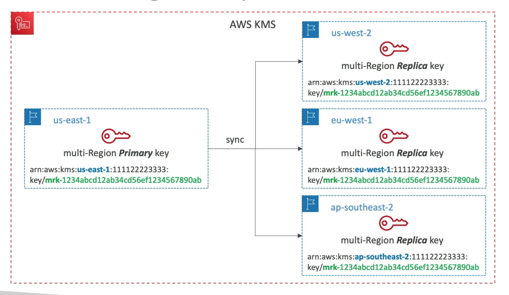
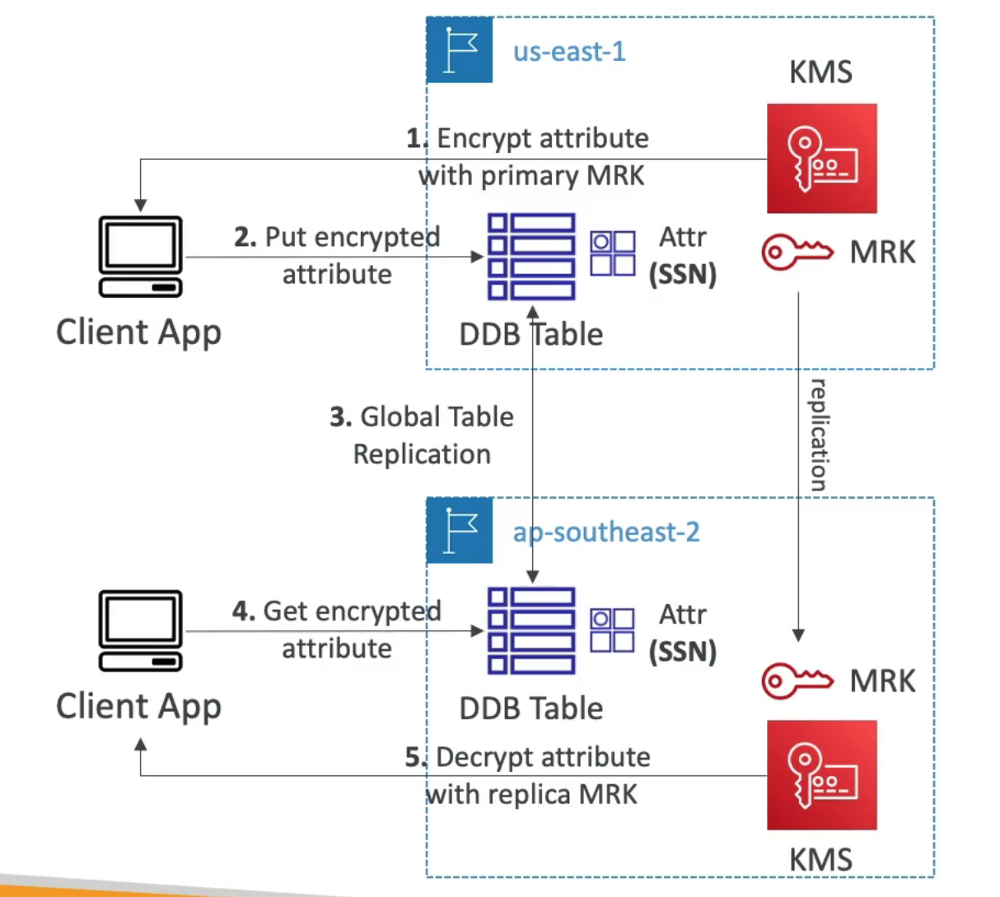
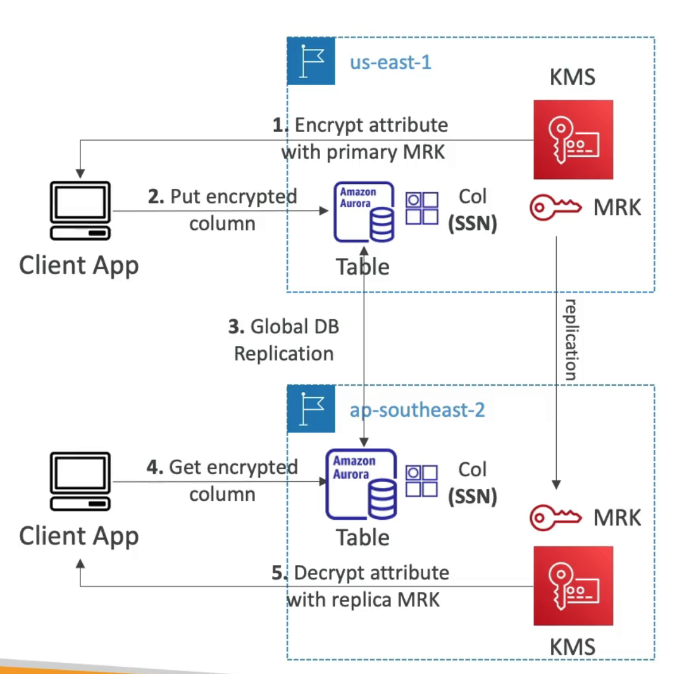

# **KMS Multi-Region Keys.**

* Identical KMS keys in different AWS regions that can be used interchangeably.
* Multi-region keys have the same key ID, key material, automatic rotation...
* We can encrypt in one region & decrypt in other regions.
* No need to re-encrypt or make cross-region API calls.
* KMS multi-region are not global (primary + replicas).
* Each multi-region key is managed independently.
* Use cases:
    * Global client-side encryption.
    * Encryption on Global DynamoDB.
    * Encryption on Global Aurora.

## **DynamoDB Global Tables & KMS Multi-Region Keys Client-Side Encryption.**

* We can encrypt specific attributes client-side in our DynamoDB table using Amazon DynamoDB Encryption Client.
* Combined with Global Tables, the client-side encrypted data is replicated to other regions.
* If we use a multi-region key, replicated in the same region as the DynamoDB Global table, then clients in these regions can use low-latency API calls to KMS in their region to decrypt the data client-side.
* Using client-side encryption we can protect specific fields & guarantee decryption only if the client has access to an API key.

## **Global Aurora & KMS Multi-Region Keys Client-Side Encryption.**

* We can encrypt specific attributes client-side in our Aurora table using the AWS Encryption SDK.
* Combined with Aurora Global tables, the client-side encrypted data is replicated to other regions.
* If we use a multi-region key, replicated in the same region as the Global Aurora DB, then clients in these regions can use low-latency API calls to KMS in their region to decrypt the data client-side.
* Using client-side encryption we can protect specific fields & guarantee decryption only if the client has access to an API key, we can protect specific fields even from DB admins.

